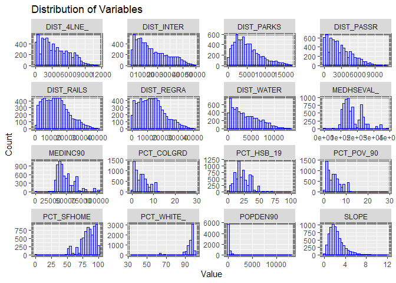
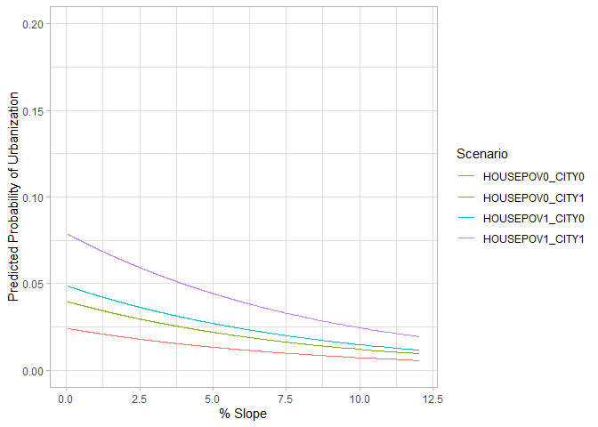
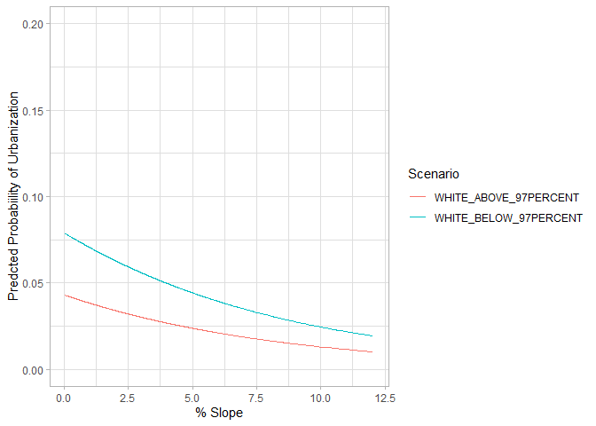

# Introduction

In this report, we will develop a binary model to predict the possibility of land-use change in Chester County, PA. We want to know:
(1) What are the main factors that determine a location to change from non-urban to urban in Chester County.
(2) What are the possibility for specific locations for land-use change in Chester County 


```r
# Read Chester land use Data and its geometry
Chester_L <- read.csv("Chester_Urban_Growth.csv") 
Chester_L_geo <-
  Chester_L%>%
  st_as_sf(coords=c("X","Y"),crs = "EPSG:25832")
```

# Summary Statistics 

<table class="table table-striped" style="">
 <thead>
  <tr>
   <th style="text-align:left;position: sticky; top:0; background-color: #FFFFFF;">   </th>
   <th style="text-align:left;position: sticky; top:0; background-color: #FFFFFF;">     SLOPE </th>
   <th style="text-align:left;position: sticky; top:0; background-color: #FFFFFF;">   DIST_WATER </th>
   <th style="text-align:left;position: sticky; top:0; background-color: #FFFFFF;">   DIST_RAILS </th>
   <th style="text-align:left;position: sticky; top:0; background-color: #FFFFFF;">   DIST_REGRA </th>
   <th style="text-align:left;position: sticky; top:0; background-color: #FFFFFF;">   DIST_PASSR </th>
   <th style="text-align:left;position: sticky; top:0; background-color: #FFFFFF;">   DIST_4LNE_ </th>
   <th style="text-align:left;position: sticky; top:0; background-color: #FFFFFF;">   DIST_INTER </th>
   <th style="text-align:left;position: sticky; top:0; background-color: #FFFFFF;">   DIST_PARKS </th>
   <th style="text-align:left;position: sticky; top:0; background-color: #FFFFFF;">    POPDEN90 </th>
   <th style="text-align:left;position: sticky; top:0; background-color: #FFFFFF;">    MEDINC90 </th>
   <th style="text-align:left;position: sticky; top:0; background-color: #FFFFFF;">   MEDHSEVAL_ </th>
   <th style="text-align:left;position: sticky; top:0; background-color: #FFFFFF;">   PCT_WHITE_ </th>
   <th style="text-align:left;position: sticky; top:0; background-color: #FFFFFF;">   PCT_SFHOME </th>
   <th style="text-align:left;position: sticky; top:0; background-color: #FFFFFF;">   PCT_POV_90 </th>
   <th style="text-align:left;position: sticky; top:0; background-color: #FFFFFF;">   PCT_HSB_19 </th>
   <th style="text-align:left;position: sticky; top:0; background-color: #FFFFFF;">   PCT_COLGRD </th>
  </tr>
 </thead>
<tbody>
  <tr>
   <td style="text-align:left;">  </td>
   <td style="text-align:left;"> Min.   : 0.050 </td>
   <td style="text-align:left;"> Min.   :    0 </td>
   <td style="text-align:left;"> Min.   :    0 </td>
   <td style="text-align:left;"> Min.   :    0 </td>
   <td style="text-align:left;"> Min.   :    0 </td>
   <td style="text-align:left;"> Min.   :    0 </td>
   <td style="text-align:left;"> Min.   :    0 </td>
   <td style="text-align:left;"> Min.   :    0 </td>
   <td style="text-align:left;"> Min.   :    0 </td>
   <td style="text-align:left;"> Min.   :     0 </td>
   <td style="text-align:left;"> Min.   :     0 </td>
   <td style="text-align:left;"> Min.   : 34.00 </td>
   <td style="text-align:left;"> Min.   :  0.00 </td>
   <td style="text-align:left;"> Min.   : 0.000 </td>
   <td style="text-align:left;"> Min.   :  0.00 </td>
   <td style="text-align:left;"> Min.   : 0.000 </td>
  </tr>
  <tr>
   <td style="text-align:left;">  </td>
   <td style="text-align:left;"> 1st Qu.: 1.344 </td>
   <td style="text-align:left;"> 1st Qu.: 1414 </td>
   <td style="text-align:left;"> 1st Qu.: 6671 </td>
   <td style="text-align:left;"> 1st Qu.: 6265 </td>
   <td style="text-align:left;"> 1st Qu.: 1000 </td>
   <td style="text-align:left;"> 1st Qu.: 1414 </td>
   <td style="text-align:left;"> 1st Qu.: 5590 </td>
   <td style="text-align:left;"> 1st Qu.: 2500 </td>
   <td style="text-align:left;"> 1st Qu.:   21 </td>
   <td style="text-align:left;"> 1st Qu.: 37986 </td>
   <td style="text-align:left;"> 1st Qu.:128000 </td>
   <td style="text-align:left;"> 1st Qu.: 94.00 </td>
   <td style="text-align:left;"> 1st Qu.: 77.00 </td>
   <td style="text-align:left;"> 1st Qu.: 2.000 </td>
   <td style="text-align:left;"> 1st Qu.: 14.00 </td>
   <td style="text-align:left;"> 1st Qu.: 2.000 </td>
  </tr>
  <tr>
   <td style="text-align:left;">  </td>
   <td style="text-align:left;"> Median : 2.048 </td>
   <td style="text-align:left;"> Median : 3162 </td>
   <td style="text-align:left;"> Median :12500 </td>
   <td style="text-align:left;"> Median :12176 </td>
   <td style="text-align:left;"> Median : 2236 </td>
   <td style="text-align:left;"> Median : 3000 </td>
   <td style="text-align:left;"> Median :12530 </td>
   <td style="text-align:left;"> Median : 4472 </td>
   <td style="text-align:left;"> Median :   61 </td>
   <td style="text-align:left;"> Median : 45074 </td>
   <td style="text-align:left;"> Median :150200 </td>
   <td style="text-align:left;"> Median : 97.00 </td>
   <td style="text-align:left;"> Median : 86.00 </td>
   <td style="text-align:left;"> Median : 4.000 </td>
   <td style="text-align:left;"> Median : 19.00 </td>
   <td style="text-align:left;"> Median : 4.000 </td>
  </tr>
  <tr>
   <td style="text-align:left;">  </td>
   <td style="text-align:left;"> Mean   : 2.407 </td>
   <td style="text-align:left;"> Mean   : 3753 </td>
   <td style="text-align:left;"> Mean   :13233 </td>
   <td style="text-align:left;"> Mean   :12918 </td>
   <td style="text-align:left;"> Mean   : 2763 </td>
   <td style="text-align:left;"> Mean   : 3416 </td>
   <td style="text-align:left;"> Mean   :15640 </td>
   <td style="text-align:left;"> Mean   : 5161 </td>
   <td style="text-align:left;"> Mean   :  189 </td>
   <td style="text-align:left;"> Mean   : 48876 </td>
   <td style="text-align:left;"> Mean   :167526 </td>
   <td style="text-align:left;"> Mean   : 94.74 </td>
   <td style="text-align:left;"> Mean   : 82.67 </td>
   <td style="text-align:left;"> Mean   : 4.424 </td>
   <td style="text-align:left;"> Mean   : 23.11 </td>
   <td style="text-align:left;"> Mean   : 4.424 </td>
  </tr>
  <tr>
   <td style="text-align:left;">  </td>
   <td style="text-align:left;"> 3rd Qu.: 3.036 </td>
   <td style="text-align:left;"> 3rd Qu.: 5701 </td>
   <td style="text-align:left;"> 3rd Qu.:18201 </td>
   <td style="text-align:left;"> 3rd Qu.:18000 </td>
   <td style="text-align:left;"> 3rd Qu.: 4123 </td>
   <td style="text-align:left;"> 3rd Qu.: 5315 </td>
   <td style="text-align:left;"> 3rd Qu.:24076 </td>
   <td style="text-align:left;"> 3rd Qu.: 7106 </td>
   <td style="text-align:left;"> 3rd Qu.:  154 </td>
   <td style="text-align:left;"> 3rd Qu.: 56394 </td>
   <td style="text-align:left;"> 3rd Qu.:214200 </td>
   <td style="text-align:left;"> 3rd Qu.: 98.00 </td>
   <td style="text-align:left;"> 3rd Qu.: 93.00 </td>
   <td style="text-align:left;"> 3rd Qu.: 6.000 </td>
   <td style="text-align:left;"> 3rd Qu.: 31.00 </td>
   <td style="text-align:left;"> 3rd Qu.: 6.000 </td>
  </tr>
  <tr>
   <td style="text-align:left;">  </td>
   <td style="text-align:left;"> Max.   :12.042 </td>
   <td style="text-align:left;"> Max.   :13730 </td>
   <td style="text-align:left;"> Max.   :40771 </td>
   <td style="text-align:left;"> Max.   :40771 </td>
   <td style="text-align:left;"> Max.   :11181 </td>
   <td style="text-align:left;"> Max.   :11511 </td>
   <td style="text-align:left;"> Max.   :49359 </td>
   <td style="text-align:left;"> Max.   :16808 </td>
   <td style="text-align:left;"> Max.   :13000 </td>
   <td style="text-align:left;"> Max.   :103043 </td>
   <td style="text-align:left;"> Max.   :384000 </td>
   <td style="text-align:left;"> Max.   :100.00 </td>
   <td style="text-align:left;"> Max.   :100.00 </td>
   <td style="text-align:left;"> Max.   :29.000 </td>
   <td style="text-align:left;"> Max.   :100.00 </td>
   <td style="text-align:left;"> Max.   :29.000 </td>
  </tr>
</tbody>
</table>

# Binary Variables

We first created a column that indicates the land-use change from non-urban to urban between 1992 and 2002. If the change occurred, it will be marked as "1" in the new column, otherwise it will be marked as "0".


```r
#Find urban land use change between 1992 and 2001
Chester_L <-
  Chester_L %>%
  mutate(CHNG_URB = URBAN01 - URBAN92) 

#Negative indicates that the urban land use  in 1992 has changed to other use in 2021. Replace them with 0.
Chester_L$CHNG_URB[Chester_L$CHNG_URB < 0] <- 0
```

# Build Binomial Logit Model 

First, we cleaned the dataset. We changed the some zeros to "NA", so the regression can bypass them.  

```r
Chester_L_clean <- Chester_L %>%
  select(DIST_WATER,DIST_RAILS, DIST_REGRA, DIST_PASSR, DIST_4LNE_, DIST_INTER, DIST_PARKS)

is.na(Chester_L_clean) <- !Chester_L_clean

Chester_Clean_2 <- Chester_L %>%
  select(-DIST_WATER,-DIST_RAILS, -DIST_REGRA, -DIST_PASSR, -DIST_4LNE_, -DIST_INTER, -DIST_PARKS)

Chester_L_Final <-
  cbind(Chester_L_clean, Chester_Clean_2)

bi_model <-
  glm(CHNG_URB ~ FOURLNE300 + INTERST800 + REGRAIL300 + RAILSTN100 + PARKS500M + WATER100 + CITBORO_10 + POPDEN90 + MEDINC90 + MEDHSEVAL_ + PCT_WHITE_ + PCT_SFHOME + PCT_POV_90 + PCT_HSB_19 + PCT_COLGRD + DIST_WATER + DIST_RAILS + DIST_REGRA + DIST_PASSR + DIST_4LNE_ + DIST_INTER+ DIST_PARKS, family = binomial, data = Chester_L_Final)

summary(bi_model)
```

```
## 
## Call:
## glm(formula = CHNG_URB ~ FOURLNE300 + INTERST800 + REGRAIL300 + 
##     RAILSTN100 + PARKS500M + WATER100 + CITBORO_10 + POPDEN90 + 
##     MEDINC90 + MEDHSEVAL_ + PCT_WHITE_ + PCT_SFHOME + PCT_POV_90 + 
##     PCT_HSB_19 + PCT_COLGRD + DIST_WATER + DIST_RAILS + DIST_REGRA + 
##     DIST_PASSR + DIST_4LNE_ + DIST_INTER + DIST_PARKS, family = binomial, 
##     data = Chester_L_Final)
## 
## Deviance Residuals: 
##     Min       1Q   Median       3Q      Max  
## -1.3520  -0.2701  -0.1676  -0.0939   3.4293  
## 
## Coefficients: (3 not defined because of singularities)
##               Estimate Std. Error z value Pr(>|z|)    
## (Intercept)  1.117e+00  1.475e+00   0.757 0.448881    
## FOURLNE300   3.361e-01  3.498e-01   0.961 0.336604    
## INTERST800   2.396e-01  2.780e-01   0.862 0.388747    
## REGRAIL300   3.772e-01  2.561e-01   1.473 0.140744    
## RAILSTN100   5.803e-01  4.174e-01   1.390 0.164464    
## PARKS500M           NA         NA      NA       NA    
## WATER100            NA         NA      NA       NA    
## CITBORO_10   6.089e-01  2.581e-01   2.359 0.018316 *  
## POPDEN90     1.060e-04  8.231e-05   1.288 0.197635    
## MEDINC90    -5.103e-06  1.003e-05  -0.509 0.610901    
## MEDHSEVAL_   2.323e-06  1.947e-06   1.193 0.232967    
## PCT_WHITE_  -2.424e-02  1.326e-02  -1.827 0.067633 .  
## PCT_SFHOME  -9.098e-03  8.260e-03  -1.102 0.270663    
## PCT_POV_90  -7.683e-02  3.281e-02  -2.342 0.019199 *  
## PCT_HSB_19   8.651e-03  7.681e-03   1.126 0.260057    
## PCT_COLGRD          NA         NA      NA       NA    
## DIST_WATER   6.913e-05  3.467e-05   1.994 0.046118 *  
## DIST_RAILS   7.671e-05  1.540e-04   0.498 0.618320    
## DIST_REGRA  -1.572e-04  1.579e-04  -0.996 0.319471    
## DIST_PASSR  -1.790e-04  6.250e-05  -2.865 0.004174 ** 
## DIST_4LNE_  -2.498e-04  9.354e-05  -2.670 0.007583 ** 
## DIST_INTER   3.208e-05  2.264e-05   1.417 0.156609    
## DIST_PARKS  -1.576e-04  4.165e-05  -3.783 0.000155 ***
## ---
## Signif. codes:  0 '***' 0.001 '**' 0.01 '*' 0.05 '.' 0.1 ' ' 1
## 
## (Dispersion parameter for binomial family taken to be 1)
## 
##     Null deviance: 1763.5  on 5493  degrees of freedom
## Residual deviance: 1411.5  on 5474  degrees of freedom
##   (1448 observations deleted due to missingness)
## AIC: 1451.5
## 
## Number of Fisher Scoring iterations: 7
```

The AIC is shown to be 1451 with very few significant variables. We then used backward and forward selection methods to give a list of the most relevant variables. Some variables returned NA in the model, which means they are co-linear with other variables. We removed these variables.


```r
#Remove "Park", "Water", "College" variables in the regression.
bi_model <-
  glm(CHNG_URB ~ FOURLNE300 + INTERST800 + REGRAIL300 + RAILSTN100 + CITBORO_10 + POPDEN90 + MEDINC90 + MEDHSEVAL_ + PCT_WHITE_ + PCT_SFHOME + PCT_POV_90 + PCT_HSB_19 + DIST_RAILS + DIST_REGRA + DIST_PASSR + DIST_4LNE_ + DIST_INTER + DIST_PARKS + DIST_WATER, family = binomial, data = Chester_L_Final)

summary(bi_model)
```

```
## 
## Call:
## glm(formula = CHNG_URB ~ FOURLNE300 + INTERST800 + REGRAIL300 + 
##     RAILSTN100 + CITBORO_10 + POPDEN90 + MEDINC90 + MEDHSEVAL_ + 
##     PCT_WHITE_ + PCT_SFHOME + PCT_POV_90 + PCT_HSB_19 + DIST_RAILS + 
##     DIST_REGRA + DIST_PASSR + DIST_4LNE_ + DIST_INTER + DIST_PARKS + 
##     DIST_WATER, family = binomial, data = Chester_L_Final)
## 
## Deviance Residuals: 
##     Min       1Q   Median       3Q      Max  
## -1.3520  -0.2701  -0.1676  -0.0939   3.4293  
## 
## Coefficients:
##               Estimate Std. Error z value Pr(>|z|)    
## (Intercept)  1.117e+00  1.475e+00   0.757 0.448881    
## FOURLNE300   3.361e-01  3.498e-01   0.961 0.336604    
## INTERST800   2.396e-01  2.780e-01   0.862 0.388747    
## REGRAIL300   3.772e-01  2.561e-01   1.473 0.140744    
## RAILSTN100   5.803e-01  4.174e-01   1.390 0.164464    
## CITBORO_10   6.089e-01  2.581e-01   2.359 0.018316 *  
## POPDEN90     1.060e-04  8.231e-05   1.288 0.197635    
## MEDINC90    -5.103e-06  1.003e-05  -0.509 0.610901    
## MEDHSEVAL_   2.323e-06  1.947e-06   1.193 0.232967    
## PCT_WHITE_  -2.424e-02  1.326e-02  -1.827 0.067633 .  
## PCT_SFHOME  -9.098e-03  8.260e-03  -1.102 0.270663    
## PCT_POV_90  -7.683e-02  3.281e-02  -2.342 0.019199 *  
## PCT_HSB_19   8.651e-03  7.681e-03   1.126 0.260057    
## DIST_RAILS   7.671e-05  1.540e-04   0.498 0.618320    
## DIST_REGRA  -1.572e-04  1.579e-04  -0.996 0.319471    
## DIST_PASSR  -1.790e-04  6.250e-05  -2.865 0.004174 ** 
## DIST_4LNE_  -2.498e-04  9.354e-05  -2.670 0.007583 ** 
## DIST_INTER   3.208e-05  2.264e-05   1.417 0.156609    
## DIST_PARKS  -1.576e-04  4.165e-05  -3.783 0.000155 ***
## DIST_WATER   6.913e-05  3.467e-05   1.994 0.046118 *  
## ---
## Signif. codes:  0 '***' 0.001 '**' 0.01 '*' 0.05 '.' 0.1 ' ' 1
## 
## (Dispersion parameter for binomial family taken to be 1)
## 
##     Null deviance: 1763.5  on 5493  degrees of freedom
## Residual deviance: 1411.5  on 5474  degrees of freedom
##   (1448 observations deleted due to missingness)
## AIC: 1451.5
## 
## Number of Fisher Scoring iterations: 7
```

The variance inflation factors (VIF) is calculated to test the co-linearity of the variables. 


```r
vif(bi_model)
```

```
## FOURLNE300 INTERST800 REGRAIL300 RAILSTN100 CITBORO_10   POPDEN90   MEDINC90 
##   3.000066   3.449423   2.710965   1.182235   1.473134   1.313002   4.500551 
## MEDHSEVAL_ PCT_WHITE_ PCT_SFHOME PCT_POV_90 PCT_HSB_19 DIST_RAILS DIST_REGRA 
##   2.501230   1.840629   2.529919   1.867165   2.175050 196.859370 215.603086 
## DIST_PASSR DIST_4LNE_ DIST_INTER DIST_PARKS DIST_WATER 
##   1.417500   3.290017   7.683299   1.677944   1.758936
```

A general rule of thumb is to not use any variables that return VIFs greater than 5 in a regression model. We thus removed DIST_RAILS, DIST_REGRA, DIST_INTER from the set. 


```r
bi_model2 <- glm(CHNG_URB ~ FOURLNE300 + INTERST800 + REGRAIL300 + RAILSTN100 + CITBORO_10 + POPDEN90 + MEDINC90 + MEDHSEVAL_+ PCT_WHITE_ + PCT_SFHOME + PCT_POV_90 + PCT_HSB_19 + DIST_PASSR + DIST_4LNE_ + DIST_PARKS + DIST_WATER, family = binomial, data = Chester_L_Final)

summary(bi_model2)
```

```
## 
## Call:
## glm(formula = CHNG_URB ~ FOURLNE300 + INTERST800 + REGRAIL300 + 
##     RAILSTN100 + CITBORO_10 + POPDEN90 + MEDINC90 + MEDHSEVAL_ + 
##     PCT_WHITE_ + PCT_SFHOME + PCT_POV_90 + PCT_HSB_19 + DIST_PASSR + 
##     DIST_4LNE_ + DIST_PARKS + DIST_WATER, family = binomial, 
##     data = Chester_L_Final)
## 
## Deviance Residuals: 
##     Min       1Q   Median       3Q      Max  
## -1.3260  -0.2815  -0.1740  -0.0940   3.3884  
## 
## Coefficients:
##               Estimate Std. Error z value Pr(>|z|)    
## (Intercept)  1.403e+00  1.399e+00   1.003 0.315900    
## FOURLNE300   3.777e-01  3.502e-01   1.079 0.280778    
## INTERST800   1.217e-01  1.891e-01   0.644 0.519807    
## REGRAIL300   8.422e-01  2.135e-01   3.944 8.01e-05 ***
## RAILSTN100   6.001e-01  3.588e-01   1.673 0.094418 .  
## CITBORO_10   6.506e-01  2.487e-01   2.616 0.008890 ** 
## POPDEN90     1.685e-04  7.986e-05   2.109 0.034921 *  
## MEDINC90    -3.588e-06  9.894e-06  -0.363 0.716861    
## MEDHSEVAL_   3.243e-06  1.929e-06   1.682 0.092647 .  
## PCT_WHITE_  -3.229e-02  1.215e-02  -2.657 0.007892 ** 
## PCT_SFHOME  -9.820e-03  8.056e-03  -1.219 0.222845    
## PCT_POV_90  -8.933e-02  3.281e-02  -2.723 0.006473 ** 
## PCT_HSB_19   6.910e-04  7.567e-03   0.091 0.927245    
## DIST_PASSR  -1.973e-04  5.908e-05  -3.340 0.000839 ***
## DIST_4LNE_  -2.416e-04  9.145e-05  -2.642 0.008250 ** 
## DIST_PARKS  -1.457e-04  3.791e-05  -3.844 0.000121 ***
## DIST_WATER   6.918e-05  3.295e-05   2.100 0.035758 *  
## ---
## Signif. codes:  0 '***' 0.001 '**' 0.01 '*' 0.05 '.' 0.1 ' ' 1
## 
## (Dispersion parameter for binomial family taken to be 1)
## 
##     Null deviance: 1810.5  on 5517  degrees of freedom
## Residual deviance: 1456.5  on 5501  degrees of freedom
##   (1424 observations deleted due to missingness)
## AIC: 1490.5
## 
## Number of Fisher Scoring iterations: 7
```

We used backward and forward selections are used to select variables that give the best results.


```r
#Backward Selection
step(glm(CHNG_URB ~ FOURLNE300 + INTERST800 + REGRAIL300 + RAILSTN100 + CITBORO_10 + POPDEN90 + MEDINC90 + MEDHSEVAL_+ PCT_WHITE_ + PCT_SFHOME + PCT_POV_90 + PCT_HSB_19 + DIST_PASSR + DIST_4LNE_ + DIST_PARKS + DIST_WATER, family = binomial, data = na.omit(Chester_L_Final)), direction = "backward")
```

```
## Start:  AIC=1458.02
## CHNG_URB ~ FOURLNE300 + INTERST800 + REGRAIL300 + RAILSTN100 + 
##     CITBORO_10 + POPDEN90 + MEDINC90 + MEDHSEVAL_ + PCT_WHITE_ + 
##     PCT_SFHOME + PCT_POV_90 + PCT_HSB_19 + DIST_PASSR + DIST_4LNE_ + 
##     DIST_PARKS + DIST_WATER
## 
##              Df Deviance    AIC
## - PCT_HSB_19  1   1424.1 1456.1
## - MEDINC90    1   1424.2 1456.2
## - INTERST800  1   1424.5 1456.5
## - PCT_SFHOME  1   1424.8 1456.8
## - FOURLNE300  1   1424.9 1456.9
## <none>            1424.0 1458.0
## - RAILSTN100  1   1426.4 1458.4
## - MEDHSEVAL_  1   1426.5 1458.5
## - POPDEN90    1   1427.7 1459.7
## - DIST_WATER  1   1429.2 1461.2
## - PCT_WHITE_  1   1429.7 1461.7
## - DIST_4LNE_  1   1432.0 1464.0
## - PCT_POV_90  1   1432.3 1464.3
## - CITBORO_10  1   1432.7 1464.7
## - DIST_PASSR  1   1436.3 1468.3
## - REGRAIL300  1   1439.2 1471.2
## - DIST_PARKS  1   1439.8 1471.8
## 
## Step:  AIC=1456.12
## CHNG_URB ~ FOURLNE300 + INTERST800 + REGRAIL300 + RAILSTN100 + 
##     CITBORO_10 + POPDEN90 + MEDINC90 + MEDHSEVAL_ + PCT_WHITE_ + 
##     PCT_SFHOME + PCT_POV_90 + DIST_PASSR + DIST_4LNE_ + DIST_PARKS + 
##     DIST_WATER
## 
##              Df Deviance    AIC
## - MEDINC90    1   1424.5 1454.5
## - INTERST800  1   1424.7 1454.7
## - PCT_SFHOME  1   1424.8 1454.8
## - FOURLNE300  1   1425.0 1455.0
## <none>            1424.1 1456.1
## - RAILSTN100  1   1426.7 1456.7
## - MEDHSEVAL_  1   1426.9 1456.9
## - POPDEN90    1   1428.1 1458.1
## - DIST_WATER  1   1429.5 1459.5
## - PCT_WHITE_  1   1429.8 1459.8
## - DIST_4LNE_  1   1432.2 1462.2
## - PCT_POV_90  1   1432.5 1462.5
## - CITBORO_10  1   1433.9 1463.9
## - DIST_PASSR  1   1436.3 1466.3
## - DIST_PARKS  1   1440.1 1470.1
## - REGRAIL300  1   1440.2 1470.2
## 
## Step:  AIC=1454.52
## CHNG_URB ~ FOURLNE300 + INTERST800 + REGRAIL300 + RAILSTN100 + 
##     CITBORO_10 + POPDEN90 + MEDHSEVAL_ + PCT_WHITE_ + PCT_SFHOME + 
##     PCT_POV_90 + DIST_PASSR + DIST_4LNE_ + DIST_PARKS + DIST_WATER
## 
##              Df Deviance    AIC
## - INTERST800  1   1425.1 1453.1
## - FOURLNE300  1   1425.4 1453.4
## <none>            1424.5 1454.5
## - RAILSTN100  1   1427.1 1455.1
## - MEDHSEVAL_  1   1427.2 1455.2
## - PCT_SFHOME  1   1427.2 1455.2
## - POPDEN90    1   1428.3 1456.3
## - DIST_WATER  1   1429.9 1457.9
## - PCT_WHITE_  1   1430.4 1458.4
## - DIST_4LNE_  1   1432.3 1460.3
## - PCT_POV_90  1   1432.7 1460.7
## - CITBORO_10  1   1434.6 1462.6
## - DIST_PASSR  1   1436.5 1464.5
## - REGRAIL300  1   1440.2 1468.2
## - DIST_PARKS  1   1440.2 1468.2
## 
## Step:  AIC=1453.09
## CHNG_URB ~ FOURLNE300 + REGRAIL300 + RAILSTN100 + CITBORO_10 + 
##     POPDEN90 + MEDHSEVAL_ + PCT_WHITE_ + PCT_SFHOME + PCT_POV_90 + 
##     DIST_PASSR + DIST_4LNE_ + DIST_PARKS + DIST_WATER
## 
##              Df Deviance    AIC
## - FOURLNE300  1   1425.9 1451.9
## <none>            1425.1 1453.1
## - RAILSTN100  1   1427.6 1453.6
## - PCT_SFHOME  1   1427.8 1453.8
## - MEDHSEVAL_  1   1428.0 1454.0
## - POPDEN90    1   1428.8 1454.8
## - PCT_WHITE_  1   1430.5 1456.5
## - DIST_WATER  1   1431.1 1457.1
## - DIST_4LNE_  1   1433.2 1459.2
## - PCT_POV_90  1   1433.3 1459.3
## - CITBORO_10  1   1435.0 1461.0
## - DIST_PASSR  1   1436.6 1462.6
## - DIST_PARKS  1   1442.9 1468.9
## - REGRAIL300  1   1448.6 1474.6
## 
## Step:  AIC=1451.92
## CHNG_URB ~ REGRAIL300 + RAILSTN100 + CITBORO_10 + POPDEN90 + 
##     MEDHSEVAL_ + PCT_WHITE_ + PCT_SFHOME + PCT_POV_90 + DIST_PASSR + 
##     DIST_4LNE_ + DIST_PARKS + DIST_WATER
## 
##              Df Deviance    AIC
## <none>            1425.9 1451.9
## - RAILSTN100  1   1428.3 1452.3
## - PCT_SFHOME  1   1428.7 1452.7
## - MEDHSEVAL_  1   1429.0 1453.0
## - POPDEN90    1   1429.6 1453.6
## - PCT_WHITE_  1   1431.4 1455.4
## - DIST_WATER  1   1432.0 1456.0
## - PCT_POV_90  1   1434.2 1458.2
## - CITBORO_10  1   1436.5 1460.5
## - DIST_PASSR  1   1437.2 1461.2
## - DIST_PARKS  1   1443.5 1467.5
## - REGRAIL300  1   1449.8 1473.8
## - DIST_4LNE_  1   1462.5 1486.5
```

```
## 
## Call:  glm(formula = CHNG_URB ~ REGRAIL300 + RAILSTN100 + CITBORO_10 + 
##     POPDEN90 + MEDHSEVAL_ + PCT_WHITE_ + PCT_SFHOME + PCT_POV_90 + 
##     DIST_PASSR + DIST_4LNE_ + DIST_PARKS + DIST_WATER, family = binomial, 
##     data = na.omit(Chester_L_Final))
## 
## Coefficients:
## (Intercept)   REGRAIL300   RAILSTN100   CITBORO_10     POPDEN90   MEDHSEVAL_  
##   1.581e+00    8.909e-01    6.472e-01    8.148e-01    1.585e-04    2.607e-06  
##  PCT_WHITE_   PCT_SFHOME   PCT_POV_90   DIST_PASSR   DIST_4LNE_   DIST_PARKS  
##  -2.979e-02   -1.034e-02   -8.746e-02   -1.912e-04   -3.217e-04   -1.490e-04  
##  DIST_WATER  
##   8.030e-05  
## 
## Degrees of Freedom: 5493 Total (i.e. Null);  5481 Residual
## Null Deviance:	    1763 
## Residual Deviance: 1426 	AIC: 1452
```

```r
#Forward Selection
fullmod<-glm(CHNG_URB ~ FOURLNE300 + INTERST800 + REGRAIL300 + RAILSTN100 + CITBORO_10 + POPDEN90 + MEDINC90 + MEDHSEVAL_+ PCT_WHITE_ + PCT_SFHOME + PCT_POV_90 + PCT_HSB_19 + DIST_PASSR + DIST_4LNE_ + DIST_PARKS + DIST_WATER, family = binomial, data = na.omit(Chester_L_Final))

intonly<-glm(CHNG_URB ~ 1, family = binomial, data = na.omit(Chester_L_Final))

step(intonly, scope=list(lower=intonly, upper=fullmod), direction="forward")
```

```
## Start:  AIC=1765.48
## CHNG_URB ~ 1
## 
##              Df Deviance    AIC
## + DIST_4LNE_  1   1580.4 1584.4
## + FOURLNE300  1   1612.0 1616.0
## + REGRAIL300  1   1614.2 1618.2
## + DIST_PASSR  1   1653.6 1657.6
## + POPDEN90    1   1715.2 1719.2
## + INTERST800  1   1718.1 1722.1
## + CITBORO_10  1   1723.6 1727.6
## + RAILSTN100  1   1725.0 1729.0
## + DIST_PARKS  1   1725.2 1729.2
## + PCT_POV_90  1   1737.1 1741.1
## + MEDHSEVAL_  1   1738.4 1742.4
## + DIST_WATER  1   1743.3 1747.3
## + MEDINC90    1   1745.3 1749.3
## + PCT_HSB_19  1   1749.9 1753.9
## + PCT_WHITE_  1   1755.3 1759.3
## + PCT_SFHOME  1   1760.5 1764.5
## <none>            1763.5 1765.5
## 
## Step:  AIC=1584.44
## CHNG_URB ~ DIST_4LNE_
## 
##              Df Deviance    AIC
## + REGRAIL300  1   1510.0 1516.0
## + DIST_PASSR  1   1545.6 1551.6
## + CITBORO_10  1   1553.3 1559.3
## + POPDEN90    1   1554.6 1560.6
## + DIST_PARKS  1   1559.0 1565.0
## + RAILSTN100  1   1561.0 1567.0
## + INTERST800  1   1562.3 1568.3
## + PCT_POV_90  1   1572.8 1578.8
## + MEDHSEVAL_  1   1573.8 1579.8
## + DIST_WATER  1   1575.2 1581.2
## + PCT_SFHOME  1   1575.7 1581.7
## <none>            1580.4 1584.4
## + PCT_HSB_19  1   1578.6 1584.6
## + FOURLNE300  1   1578.7 1584.7
## + MEDINC90    1   1579.3 1585.3
## + PCT_WHITE_  1   1580.3 1586.3
## 
## Step:  AIC=1515.98
## CHNG_URB ~ DIST_4LNE_ + REGRAIL300
## 
##              Df Deviance    AIC
## + CITBORO_10  1   1482.1 1490.1
## + DIST_PASSR  1   1492.0 1500.0
## + POPDEN90    1   1492.5 1500.5
## + DIST_PARKS  1   1493.0 1501.0
## + PCT_SFHOME  1   1504.1 1512.1
## + RAILSTN100  1   1504.4 1512.4
## + PCT_HSB_19  1   1506.5 1514.5
## <none>            1510.0 1516.0
## + PCT_POV_90  1   1508.0 1516.0
## + FOURLNE300  1   1508.5 1516.5
## + MEDHSEVAL_  1   1508.8 1516.8
## + PCT_WHITE_  1   1509.2 1517.2
## + INTERST800  1   1509.3 1517.3
## + DIST_WATER  1   1509.5 1517.5
## + MEDINC90    1   1509.6 1517.6
## 
## Step:  AIC=1490.12
## CHNG_URB ~ DIST_4LNE_ + REGRAIL300 + CITBORO_10
## 
##              Df Deviance    AIC
## + DIST_PARKS  1   1466.9 1476.9
## + DIST_PASSR  1   1473.2 1483.2
## + POPDEN90    1   1473.7 1483.7
## + PCT_POV_90  1   1476.0 1486.0
## + RAILSTN100  1   1477.9 1487.9
## + MEDHSEVAL_  1   1478.1 1488.1
## <none>            1482.1 1490.1
## + INTERST800  1   1480.2 1490.2
## + PCT_SFHOME  1   1480.3 1490.3
## + FOURLNE300  1   1481.3 1491.3
## + DIST_WATER  1   1481.4 1491.4
## + MEDINC90    1   1481.8 1491.8
## + PCT_HSB_19  1   1482.1 1492.1
## + PCT_WHITE_  1   1482.1 1492.1
## 
## Step:  AIC=1476.88
## CHNG_URB ~ DIST_4LNE_ + REGRAIL300 + CITBORO_10 + DIST_PARKS
## 
##              Df Deviance    AIC
## + DIST_PASSR  1   1457.4 1469.4
## + DIST_WATER  1   1459.9 1471.9
## + POPDEN90    1   1460.1 1472.1
## + RAILSTN100  1   1463.2 1475.2
## + PCT_POV_90  1   1463.5 1475.5
## + MEDHSEVAL_  1   1463.8 1475.8
## + PCT_SFHOME  1   1464.9 1476.9
## <none>            1466.9 1476.9
## + FOURLNE300  1   1465.9 1477.9
## + PCT_WHITE_  1   1466.4 1478.4
## + PCT_HSB_19  1   1466.6 1478.6
## + INTERST800  1   1466.6 1478.6
## + MEDINC90    1   1466.9 1478.9
## 
## Step:  AIC=1469.44
## CHNG_URB ~ DIST_4LNE_ + REGRAIL300 + CITBORO_10 + DIST_PARKS + 
##     DIST_PASSR
## 
##              Df Deviance    AIC
## + DIST_WATER  1   1447.6 1461.6
## + POPDEN90    1   1451.1 1465.1
## + MEDHSEVAL_  1   1451.2 1465.2
## + PCT_POV_90  1   1452.6 1466.6
## + RAILSTN100  1   1453.3 1467.3
## <none>            1457.4 1469.4
## + INTERST800  1   1456.1 1470.1
## + FOURLNE300  1   1456.3 1470.3
## + PCT_SFHOME  1   1456.7 1470.7
## + MEDINC90    1   1457.0 1471.0
## + PCT_HSB_19  1   1457.0 1471.0
## + PCT_WHITE_  1   1457.3 1471.3
## 
## Step:  AIC=1461.63
## CHNG_URB ~ DIST_4LNE_ + REGRAIL300 + CITBORO_10 + DIST_PARKS + 
##     DIST_PASSR + DIST_WATER
## 
##              Df Deviance    AIC
## + POPDEN90    1   1442.6 1458.6
## + PCT_POV_90  1   1443.8 1459.8
## + RAILSTN100  1   1443.9 1459.9
## + MEDHSEVAL_  1   1445.3 1461.3
## <none>            1447.6 1461.6
## + PCT_SFHOME  1   1446.5 1462.5
## + PCT_WHITE_  1   1446.7 1462.7
## + FOURLNE300  1   1446.7 1462.7
## + INTERST800  1   1447.4 1463.4
## + PCT_HSB_19  1   1447.4 1463.4
## + MEDINC90    1   1447.6 1463.6
## 
## Step:  AIC=1458.59
## CHNG_URB ~ DIST_4LNE_ + REGRAIL300 + CITBORO_10 + DIST_PARKS + 
##     DIST_PASSR + DIST_WATER + POPDEN90
## 
##              Df Deviance    AIC
## + PCT_POV_90  1   1437.9 1455.9
## + RAILSTN100  1   1439.4 1457.4
## + MEDHSEVAL_  1   1439.8 1457.8
## <none>            1442.6 1458.6
## + FOURLNE300  1   1441.7 1459.7
## + PCT_WHITE_  1   1441.9 1459.9
## + INTERST800  1   1442.2 1460.2
## + PCT_SFHOME  1   1442.3 1460.3
## + MEDINC90    1   1442.6 1460.6
## + PCT_HSB_19  1   1442.6 1460.6
## 
## Step:  AIC=1455.88
## CHNG_URB ~ DIST_4LNE_ + REGRAIL300 + CITBORO_10 + DIST_PARKS + 
##     DIST_PASSR + DIST_WATER + POPDEN90 + PCT_POV_90
## 
##              Df Deviance    AIC
## + PCT_WHITE_  1   1433.9 1453.9
## + RAILSTN100  1   1434.7 1454.7
## <none>            1437.9 1455.9
## + PCT_SFHOME  1   1436.0 1456.0
## + MEDHSEVAL_  1   1436.7 1456.7
## + FOURLNE300  1   1437.0 1457.0
## + PCT_HSB_19  1   1437.1 1457.1
## + MEDINC90    1   1437.5 1457.5
## + INTERST800  1   1437.7 1457.7
## 
## Step:  AIC=1453.88
## CHNG_URB ~ DIST_4LNE_ + REGRAIL300 + CITBORO_10 + DIST_PARKS + 
##     DIST_PASSR + DIST_WATER + POPDEN90 + PCT_POV_90 + PCT_WHITE_
## 
##              Df Deviance    AIC
## + RAILSTN100  1   1430.8 1452.8
## + PCT_SFHOME  1   1431.3 1453.3
## <none>            1433.9 1453.9
## + MEDHSEVAL_  1   1431.9 1453.9
## + FOURLNE300  1   1433.0 1455.0
## + PCT_HSB_19  1   1433.1 1455.1
## + INTERST800  1   1433.2 1455.2
## + MEDINC90    1   1433.6 1455.6
## 
## Step:  AIC=1452.83
## CHNG_URB ~ DIST_4LNE_ + REGRAIL300 + CITBORO_10 + DIST_PARKS + 
##     DIST_PASSR + DIST_WATER + POPDEN90 + PCT_POV_90 + PCT_WHITE_ + 
##     RAILSTN100
## 
##              Df Deviance    AIC
## + MEDHSEVAL_  1   1428.7 1452.7
## <none>            1430.8 1452.8
## + PCT_SFHOME  1   1429.0 1453.0
## + FOURLNE300  1   1429.8 1453.8
## + INTERST800  1   1430.1 1454.1
## + PCT_HSB_19  1   1430.4 1454.4
## + MEDINC90    1   1430.7 1454.7
## 
## Step:  AIC=1452.72
## CHNG_URB ~ DIST_4LNE_ + REGRAIL300 + CITBORO_10 + DIST_PARKS + 
##     DIST_PASSR + DIST_WATER + POPDEN90 + PCT_POV_90 + PCT_WHITE_ + 
##     RAILSTN100 + MEDHSEVAL_
## 
##              Df Deviance    AIC
## + PCT_SFHOME  1   1425.9 1451.9
## + MEDINC90    1   1426.2 1452.2
## <none>            1428.7 1452.7
## + FOURLNE300  1   1427.8 1453.8
## + PCT_HSB_19  1   1428.1 1454.1
## + INTERST800  1   1428.2 1454.2
## 
## Step:  AIC=1451.92
## CHNG_URB ~ DIST_4LNE_ + REGRAIL300 + CITBORO_10 + DIST_PARKS + 
##     DIST_PASSR + DIST_WATER + POPDEN90 + PCT_POV_90 + PCT_WHITE_ + 
##     RAILSTN100 + MEDHSEVAL_ + PCT_SFHOME
## 
##              Df Deviance    AIC
## <none>            1425.9 1451.9
## + FOURLNE300  1   1425.1 1453.1
## + INTERST800  1   1425.4 1453.4
## + MEDINC90    1   1425.5 1453.5
## + PCT_HSB_19  1   1425.5 1453.5
```

```
## 
## Call:  glm(formula = CHNG_URB ~ DIST_4LNE_ + REGRAIL300 + CITBORO_10 + 
##     DIST_PARKS + DIST_PASSR + DIST_WATER + POPDEN90 + PCT_POV_90 + 
##     PCT_WHITE_ + RAILSTN100 + MEDHSEVAL_ + PCT_SFHOME, family = binomial, 
##     data = na.omit(Chester_L_Final))
## 
## Coefficients:
## (Intercept)   DIST_4LNE_   REGRAIL300   CITBORO_10   DIST_PARKS   DIST_PASSR  
##   1.581e+00   -3.217e-04    8.909e-01    8.148e-01   -1.490e-04   -1.912e-04  
##  DIST_WATER     POPDEN90   PCT_POV_90   PCT_WHITE_   RAILSTN100   MEDHSEVAL_  
##   8.030e-05    1.585e-04   -8.746e-02   -2.979e-02    6.472e-01    2.607e-06  
##  PCT_SFHOME  
##  -1.034e-02  
## 
## Degrees of Freedom: 5493 Total (i.e. Null);  5481 Residual
## Null Deviance:	    1763 
## Residual Deviance: 1426 	AIC: 1452
```

The best result is given by both the backward and forward selections, with the lowest AIC of 1452. The variables included in the model are DIST_4LNE_, REGRAIL300, CITBORO_10, DIST_PARKS, DIST_PASSR, DIST_WATER, POPDEN90, PCT_POV_90, PCT_WHITE_, RAILSTN100, MEDHSEVAL_, PCT_SFHOME. The forward selection also omitted any row that contains NA, so there are less observations. 


```r
bi_model3 <- glm(CHNG_URB ~ REGRAIL300 + RAILSTN100 + CITBORO_10 + 
POPDEN90 + MEDHSEVAL_ + PCT_WHITE_ + PCT_SFHOME + PCT_POV_90 + 
DIST_PASSR + DIST_4LNE_ + DIST_PARKS + DIST_WATER, family = binomial, data = na.omit(Chester_L_Final))

summary(bi_model3)
```

```
## 
## Call:
## glm(formula = CHNG_URB ~ REGRAIL300 + RAILSTN100 + CITBORO_10 + 
##     POPDEN90 + MEDHSEVAL_ + PCT_WHITE_ + PCT_SFHOME + PCT_POV_90 + 
##     DIST_PASSR + DIST_4LNE_ + DIST_PARKS + DIST_WATER, family = binomial, 
##     data = na.omit(Chester_L_Final))
## 
## Deviance Residuals: 
##     Min       1Q   Median       3Q      Max  
## -1.3087  -0.2764  -0.1764  -0.0934   3.4311  
## 
## Coefficients:
##               Estimate Std. Error z value Pr(>|z|)    
## (Intercept)  1.581e+00  1.333e+00   1.186 0.235462    
## REGRAIL300   8.909e-01  1.787e-01   4.986 6.17e-07 ***
## RAILSTN100   6.472e-01  4.063e-01   1.593 0.111179    
## CITBORO_10   8.148e-01  2.390e-01   3.409 0.000653 ***
## POPDEN90     1.585e-04  7.935e-05   1.998 0.045737 *  
## MEDHSEVAL_   2.607e-06  1.474e-06   1.768 0.076982 .  
## PCT_WHITE_  -2.979e-02  1.217e-02  -2.449 0.014339 *  
## PCT_SFHOME  -1.034e-02  6.054e-03  -1.707 0.087775 .  
## PCT_POV_90  -8.746e-02  3.216e-02  -2.720 0.006529 ** 
## DIST_PASSR  -1.912e-04  5.960e-05  -3.208 0.001334 ** 
## DIST_4LNE_  -3.217e-04  5.720e-05  -5.624 1.87e-08 ***
## DIST_PARKS  -1.490e-04  3.732e-05  -3.993 6.54e-05 ***
## DIST_WATER   8.030e-05  3.271e-05   2.455 0.014098 *  
## ---
## Signif. codes:  0 '***' 0.001 '**' 0.01 '*' 0.05 '.' 0.1 ' ' 1
## 
## (Dispersion parameter for binomial family taken to be 1)
## 
##     Null deviance: 1763.5  on 5493  degrees of freedom
## Residual deviance: 1425.9  on 5481  degrees of freedom
## AIC: 1451.9
## 
## Number of Fisher Scoring iterations: 7
```

```r
#Delete the insignificant variable RAILSTN100

bi_model3 <- glm(CHNG_URB ~ REGRAIL300 + CITBORO_10 + 
POPDEN90 + MEDHSEVAL_ + PCT_WHITE_ + PCT_SFHOME + PCT_POV_90 + 
DIST_PASSR + DIST_4LNE_ + DIST_PARKS + DIST_WATER, family = binomial, data = na.omit(Chester_L_Final))

summary(bi_model3)
```

```
## 
## Call:
## glm(formula = CHNG_URB ~ REGRAIL300 + CITBORO_10 + POPDEN90 + 
##     MEDHSEVAL_ + PCT_WHITE_ + PCT_SFHOME + PCT_POV_90 + DIST_PASSR + 
##     DIST_4LNE_ + DIST_PARKS + DIST_WATER, family = binomial, 
##     data = na.omit(Chester_L_Final))
## 
## Deviance Residuals: 
##     Min       1Q   Median       3Q      Max  
## -1.3642  -0.2755  -0.1756  -0.0925   3.4395  
## 
## Coefficients:
##               Estimate Std. Error z value Pr(>|z|)    
## (Intercept)  1.753e+00  1.323e+00   1.324 0.185349    
## REGRAIL300   9.513e-01  1.731e-01   5.497 3.87e-08 ***
## CITBORO_10   8.236e-01  2.380e-01   3.460 0.000539 ***
## POPDEN90     1.627e-04  7.882e-05   2.064 0.039032 *  
## MEDHSEVAL_   2.579e-06  1.467e-06   1.758 0.078815 .  
## PCT_WHITE_  -3.047e-02  1.214e-02  -2.510 0.012082 *  
## PCT_SFHOME  -1.146e-02  5.942e-03  -1.928 0.053873 .  
## PCT_POV_90  -8.999e-02  3.210e-02  -2.804 0.005051 ** 
## DIST_PASSR  -1.857e-04  5.934e-05  -3.129 0.001753 ** 
## DIST_4LNE_  -3.259e-04  5.721e-05  -5.697 1.22e-08 ***
## DIST_PARKS  -1.522e-04  3.740e-05  -4.071 4.69e-05 ***
## DIST_WATER   8.196e-05  3.268e-05   2.508 0.012136 *  
## ---
## Signif. codes:  0 '***' 0.001 '**' 0.01 '*' 0.05 '.' 0.1 ' ' 1
## 
## (Dispersion parameter for binomial family taken to be 1)
## 
##     Null deviance: 1763.5  on 5493  degrees of freedom
## Residual deviance: 1428.3  on 5482  degrees of freedom
## AIC: 1452.3
## 
## Number of Fisher Scoring iterations: 7
```

# Test the fitness of model

From the model summary above, we know that the degree freedom is 5493. We calculated the model fitness using ChiSq. 


```r
qchisq(.95, df=5493) 
```

```
## [1] 5666.533
```

The critical value is 5666.533. The null deviance value of the model (1763.5) is much lower than the critical value, meaning our predicted results will have no significant difference from the observations.


```r
model3_fitness <- gof(bi_model3, plotROC = FALSE)

model3_fitness$gof
```

```
##          test  stat        val df         pVal
## 1:         HL chiSq  6.2878215  8 6.150261e-01
## 2:        mHL     F  6.1202125  9 1.305332e-08
## 3:       OsRo     Z -0.6968019 NA 4.859268e-01
## 4: SstPgeq0.5     Z  1.8123489 NA 6.993230e-02
## 5:   SstPl0.5     Z  1.9817348 NA 4.750893e-02
## 6:    SstBoth chiSq  7.2118815  2 2.716188e-02
## 7: SllPgeq0.5 chiSq  9.3139124  1 2.274203e-03
## 8:   SllPl0.5 chiSq  4.3522053  1 3.696106e-02
## 9:    SllBoth chiSq 11.4126946  2 3.324795e-03
```

# Model Results and Fitness


```r
exp(coef(bi_model3))
```

```
## (Intercept)  REGRAIL300  CITBORO_10    POPDEN90  MEDHSEVAL_  PCT_WHITE_ 
##   5.7697776   2.5891393   2.2787262   1.0001627   1.0000026   0.9699867 
##  PCT_SFHOME  PCT_POV_90  DIST_PASSR  DIST_4LNE_  DIST_PARKS  DIST_WATER 
##   0.9886093   0.9139362   0.9998143   0.9996742   0.9998478   1.0000820
```

```r
100 * (exp(coef(bi_model3))-1)
```

```
##   (Intercept)    REGRAIL300    CITBORO_10      POPDEN90    MEDHSEVAL_ 
##  4.769778e+02  1.589139e+02  1.278726e+02  1.626796e-02  2.579135e-04 
##    PCT_WHITE_    PCT_SFHOME    PCT_POV_90    DIST_PASSR    DIST_4LNE_ 
## -3.001326e+00 -1.139073e+00 -8.606384e+00 -1.856605e-02 -3.258445e-02 
##    DIST_PARKS    DIST_WATER 
## -1.522334e-02  8.196203e-03
```

Several goodness of fit tests, suggest that the model's predicted results are in the reasonable range similar to that of the original data (with the p-values greater than 5%).

According to the model, the most important factors that explains the land use change between 1992 and 2001 are, from greatest to least, 1) if the location is within 300 meters of a SPETA regional rail line, 2) if the location is within 1,000 meters of a city or boro, 3) the location's percent of households living below poverty line in 1990, and 4) the location's percent of white households. These three factors have the largest impact on the possibility of a location being urbanized. 

Every percentage increase in households living below poverty line is associated with a 8% decrease in the odd ratio. The odd ratio is the possibility of success over possibility of failure. A decrease in the odd ratio means that the location will households less chance to turn into a urban area when the percent of households living in poverty increases. 

In the same way, for every percent of increase in white population, there is a 3% decrease in chance of successfully being urbanized.

If a location is within the 300 meters of a SPETA regional railway, it will have 159% increase in the chance of being urbanized comparing to those that are outside of the range. 

If a location is within 1000 meters of another city or boro, the chance of being urbanized is increased by 128%. 

## Model Improvement

The statistic summary shows that majority of Chester County has high income and low poverty rate. This might suggest that the distribution of these variables might be skewed. 


```r
Chester_Numeric %>%
  gather(Variable, Value) %>%
  ggplot(aes(Value)) + 
    geom_histogram(bins = 30, color="blue", fill="blue", alpha=0.2) + 
    facet_wrap(~Variable, scales = 'free')+
    labs(title = "Distribution of Variables") + ylab("Count")  +
  theme(panel.background = element_rect(colour = "grey50", size=3))
```

<!-- -->

Most of the data are highly skewed. We created some dummy variables to adjust the dataset. 

The thresholds for the new binary variables are based on their median value in the dataset. 


```r
summary(Chester_Numeric)

# REGRAIL300 + CITBORO_10 + 
# POPDEN90 + MEDHSEVAL_ + PCT_WHITE_ + PCT_SFHOME + PCT_POV_90 + 
# DIST_PASSR + DIST_4LNE_ + DIST_PARKS + DIST_WATER

Chester_bi <-
  Chester_L_Final%>%
  mutate(bi_POV_less4 = case_when(PCT_POV_90 < 4 ~ 1, TRUE ~ 0),
         bi_POPDEN_less60 = case_when(POPDEN90 < 60 ~ 1, TRUE ~ 0),
         bi_WHITE_less97 = case_when(PCT_WHITE_ < 97 ~ 1, TRUE ~ 0),
         bi_SFHOME = case_when(PCT_SFHOME < 86 ~ 1, TRUE ~ 0))
```


```r
#Replace log infinite with NA
Chester_bi <- do.call(data.frame,                      
               lapply(Chester_bi,
              function(x) replace(x, is.infinite(x), NA)))

#Model
bi_model_bi <- glm(CHNG_URB ~ FOURLNE300 + INTERST800 + REGRAIL300 + RAILSTN100 + CITBORO_10 + PARKS500M + WATER100 + 
bi_POPDEN_less60 + MEDHSEVAL_ + bi_WHITE_less97 + bi_SFHOME + bi_POV_less4  + DIST_PASSR + DIST_4LNE_ + DIST_PARKS  + DIST_WATER + DIST_RAILS + DIST_REGRA + DIST_INTER + PCT_HSB_19 + SLOPE + MEDINC90 , family = binomial, data = na.omit(Chester_bi))

summary(bi_model_bi)
```

```
## 
## Call:
## glm(formula = CHNG_URB ~ FOURLNE300 + INTERST800 + REGRAIL300 + 
##     RAILSTN100 + CITBORO_10 + PARKS500M + WATER100 + bi_POPDEN_less60 + 
##     MEDHSEVAL_ + bi_WHITE_less97 + bi_SFHOME + bi_POV_less4 + 
##     DIST_PASSR + DIST_4LNE_ + DIST_PARKS + DIST_WATER + DIST_RAILS + 
##     DIST_REGRA + DIST_INTER + PCT_HSB_19 + SLOPE + MEDINC90, 
##     family = binomial, data = na.omit(Chester_bi))
## 
## Deviance Residuals: 
##     Min       1Q   Median       3Q      Max  
## -1.4204  -0.2662  -0.1513  -0.0847   3.2871  
## 
## Coefficients: (2 not defined because of singularities)
##                    Estimate Std. Error z value Pr(>|z|)    
## (Intercept)      -2.645e+00  8.085e-01  -3.272 0.001068 ** 
## FOURLNE300        3.350e-01  3.467e-01   0.966 0.333921    
## INTERST800        2.924e-01  2.768e-01   1.056 0.290790    
## REGRAIL300        3.157e-01  2.605e-01   1.212 0.225590    
## RAILSTN100        4.492e-01  4.272e-01   1.051 0.293093    
## CITBORO_10        4.939e-01  2.603e-01   1.898 0.057735 .  
## PARKS500M                NA         NA      NA       NA    
## WATER100                 NA         NA      NA       NA    
## bi_POPDEN_less60 -7.440e-01  1.974e-01  -3.769 0.000164 ***
## MEDHSEVAL_        7.207e-07  1.889e-06   0.382 0.702785    
## bi_WHITE_less97   6.023e-01  1.946e-01   3.095 0.001970 ** 
## bi_SFHOME         4.004e-01  2.217e-01   1.806 0.070938 .  
## bi_POV_less4      7.059e-01  2.137e-01   3.303 0.000956 ***
## DIST_PASSR       -1.379e-04  6.743e-05  -2.044 0.040908 *  
## DIST_4LNE_       -2.581e-04  9.219e-05  -2.800 0.005107 ** 
## DIST_PARKS       -1.244e-04  4.209e-05  -2.956 0.003121 ** 
## DIST_WATER        1.866e-05  3.576e-05   0.522 0.601786    
## DIST_RAILS        1.821e-04  1.577e-04   1.155 0.248235    
## DIST_REGRA       -2.580e-04  1.622e-04  -1.591 0.111706    
## DIST_INTER        2.856e-05  2.358e-05   1.211 0.225824    
## PCT_HSB_19        1.617e-02  7.314e-03   2.211 0.027047 *  
## SLOPE            -1.123e-01  5.172e-02  -2.171 0.029963 *  
## MEDINC90         -3.646e-06  9.342e-06  -0.390 0.696354    
## ---
## Signif. codes:  0 '***' 0.001 '**' 0.01 '*' 0.05 '.' 0.1 ' ' 1
## 
## (Dispersion parameter for binomial family taken to be 1)
## 
##     Null deviance: 1763.5  on 5493  degrees of freedom
## Residual deviance: 1376.2  on 5473  degrees of freedom
## AIC: 1418.2
## 
## Number of Fisher Scoring iterations: 8
```

Just by creating dummy variables, even before variable selection, the model's AIC is reduced by 200. Some of the variables are co-linear with each other, we removed them from the final model.


```r
#Backward Selection Log

step(glm(CHNG_URB ~ FOURLNE300 + INTERST800 + REGRAIL300 + RAILSTN100 + CITBORO_10 + PARKS500M + WATER100 + 
bi_POPDEN_less60 + MEDHSEVAL_ + bi_WHITE_less97 + bi_SFHOME + bi_POV_less4  + DIST_PASSR + DIST_4LNE_ + DIST_PARKS  + DIST_WATER + DIST_RAILS + DIST_REGRA + DIST_INTER + PCT_HSB_19 + SLOPE + MEDINC90 , family = binomial, data = na.omit(Chester_bi)))
```

```
## Start:  AIC=1418.15
## CHNG_URB ~ FOURLNE300 + INTERST800 + REGRAIL300 + RAILSTN100 + 
##     CITBORO_10 + PARKS500M + WATER100 + bi_POPDEN_less60 + MEDHSEVAL_ + 
##     bi_WHITE_less97 + bi_SFHOME + bi_POV_less4 + DIST_PASSR + 
##     DIST_4LNE_ + DIST_PARKS + DIST_WATER + DIST_RAILS + DIST_REGRA + 
##     DIST_INTER + PCT_HSB_19 + SLOPE + MEDINC90
## 
## 
## Step:  AIC=1418.15
## CHNG_URB ~ FOURLNE300 + INTERST800 + REGRAIL300 + RAILSTN100 + 
##     CITBORO_10 + PARKS500M + bi_POPDEN_less60 + MEDHSEVAL_ + 
##     bi_WHITE_less97 + bi_SFHOME + bi_POV_less4 + DIST_PASSR + 
##     DIST_4LNE_ + DIST_PARKS + DIST_WATER + DIST_RAILS + DIST_REGRA + 
##     DIST_INTER + PCT_HSB_19 + SLOPE + MEDINC90
## 
## 
## Step:  AIC=1418.15
## CHNG_URB ~ FOURLNE300 + INTERST800 + REGRAIL300 + RAILSTN100 + 
##     CITBORO_10 + bi_POPDEN_less60 + MEDHSEVAL_ + bi_WHITE_less97 + 
##     bi_SFHOME + bi_POV_less4 + DIST_PASSR + DIST_4LNE_ + DIST_PARKS + 
##     DIST_WATER + DIST_RAILS + DIST_REGRA + DIST_INTER + PCT_HSB_19 + 
##     SLOPE + MEDINC90
## 
##                    Df Deviance    AIC
## - MEDHSEVAL_        1   1376.3 1416.3
## - MEDINC90          1   1376.3 1416.3
## - DIST_WATER        1   1376.4 1416.4
## - FOURLNE300        1   1377.1 1417.1
## - RAILSTN100        1   1377.2 1417.2
## - INTERST800        1   1377.3 1417.3
## - DIST_RAILS        1   1377.5 1417.5
## - REGRAIL300        1   1377.6 1417.6
## - DIST_INTER        1   1377.6 1417.6
## <none>                  1376.2 1418.2
## - DIST_REGRA        1   1378.6 1418.6
## - bi_SFHOME         1   1379.5 1419.5
## - CITBORO_10        1   1379.6 1419.6
## - DIST_PASSR        1   1380.5 1420.5
## - PCT_HSB_19        1   1381.0 1421.0
## - SLOPE             1   1381.1 1421.1
## - DIST_4LNE_        1   1384.4 1424.4
## - DIST_PARKS        1   1385.3 1425.3
## - bi_WHITE_less97   1   1386.1 1426.1
## - bi_POV_less4      1   1387.7 1427.7
## - bi_POPDEN_less60  1   1391.8 1431.8
## 
## Step:  AIC=1416.3
## CHNG_URB ~ FOURLNE300 + INTERST800 + REGRAIL300 + RAILSTN100 + 
##     CITBORO_10 + bi_POPDEN_less60 + bi_WHITE_less97 + bi_SFHOME + 
##     bi_POV_less4 + DIST_PASSR + DIST_4LNE_ + DIST_PARKS + DIST_WATER + 
##     DIST_RAILS + DIST_REGRA + DIST_INTER + PCT_HSB_19 + SLOPE + 
##     MEDINC90
## 
##                    Df Deviance    AIC
## - MEDINC90          1   1376.3 1414.3
## - DIST_WATER        1   1376.7 1414.7
## - FOURLNE300        1   1377.3 1415.3
## - RAILSTN100        1   1377.3 1415.3
## - INTERST800        1   1377.5 1415.5
## - DIST_RAILS        1   1377.7 1415.7
## - REGRAIL300        1   1377.8 1415.8
## - DIST_INTER        1   1377.8 1415.8
## <none>                  1376.3 1416.3
## - DIST_REGRA        1   1378.8 1416.8
## - CITBORO_10        1   1379.6 1417.6
## - bi_SFHOME         1   1379.9 1417.9
## - DIST_PASSR        1   1380.5 1418.5
## - SLOPE             1   1381.2 1419.2
## - PCT_HSB_19        1   1381.7 1419.7
## - DIST_4LNE_        1   1384.5 1422.5
## - DIST_PARKS        1   1385.6 1423.6
## - bi_WHITE_less97   1   1386.4 1424.4
## - bi_POV_less4      1   1388.6 1426.6
## - bi_POPDEN_less60  1   1392.1 1430.1
## 
## Step:  AIC=1414.35
## CHNG_URB ~ FOURLNE300 + INTERST800 + REGRAIL300 + RAILSTN100 + 
##     CITBORO_10 + bi_POPDEN_less60 + bi_WHITE_less97 + bi_SFHOME + 
##     bi_POV_less4 + DIST_PASSR + DIST_4LNE_ + DIST_PARKS + DIST_WATER + 
##     DIST_RAILS + DIST_REGRA + DIST_INTER + PCT_HSB_19 + SLOPE
## 
##                    Df Deviance    AIC
## - DIST_WATER        1   1376.7 1412.7
## - FOURLNE300        1   1377.3 1413.3
## - RAILSTN100        1   1377.4 1413.4
## - INTERST800        1   1377.5 1413.5
## - DIST_RAILS        1   1377.7 1413.7
## - REGRAIL300        1   1377.8 1413.8
## - DIST_INTER        1   1377.9 1413.9
## <none>                  1376.3 1414.3
## - DIST_REGRA        1   1378.9 1414.9
## - CITBORO_10        1   1379.8 1415.8
## - DIST_PASSR        1   1380.5 1416.5
## - SLOPE             1   1381.3 1417.3
## - bi_SFHOME         1   1382.8 1418.8
## - PCT_HSB_19        1   1382.8 1418.8
## - DIST_4LNE_        1   1384.5 1420.5
## - DIST_PARKS        1   1385.6 1421.6
## - bi_WHITE_less97   1   1386.5 1422.5
## - bi_POV_less4      1   1388.8 1424.8
## - bi_POPDEN_less60  1   1392.2 1428.2
## 
## Step:  AIC=1412.68
## CHNG_URB ~ FOURLNE300 + INTERST800 + REGRAIL300 + RAILSTN100 + 
##     CITBORO_10 + bi_POPDEN_less60 + bi_WHITE_less97 + bi_SFHOME + 
##     bi_POV_less4 + DIST_PASSR + DIST_4LNE_ + DIST_PARKS + DIST_RAILS + 
##     DIST_REGRA + DIST_INTER + PCT_HSB_19 + SLOPE
## 
##                    Df Deviance    AIC
## - FOURLNE300        1   1377.7 1411.7
## - RAILSTN100        1   1377.7 1411.7
## - INTERST800        1   1378.0 1412.0
## - DIST_INTER        1   1378.2 1412.2
## - REGRAIL300        1   1378.3 1412.3
## - DIST_RAILS        1   1378.4 1412.4
## <none>                  1376.7 1412.7
## - DIST_REGRA        1   1379.7 1413.7
## - CITBORO_10        1   1380.1 1414.1
## - DIST_PASSR        1   1380.6 1414.6
## - SLOPE             1   1382.3 1416.3
## - bi_SFHOME         1   1383.2 1417.2
## - PCT_HSB_19        1   1383.6 1417.6
## - DIST_4LNE_        1   1385.2 1419.2
## - DIST_PARKS        1   1386.3 1420.3
## - bi_WHITE_less97   1   1388.1 1422.1
## - bi_POV_less4      1   1389.9 1423.9
## - bi_POPDEN_less60  1   1392.9 1426.9
## 
## Step:  AIC=1411.7
## CHNG_URB ~ INTERST800 + REGRAIL300 + RAILSTN100 + CITBORO_10 + 
##     bi_POPDEN_less60 + bi_WHITE_less97 + bi_SFHOME + bi_POV_less4 + 
##     DIST_PASSR + DIST_4LNE_ + DIST_PARKS + DIST_RAILS + DIST_REGRA + 
##     DIST_INTER + PCT_HSB_19 + SLOPE
## 
##                    Df Deviance    AIC
## - RAILSTN100        1   1378.7 1410.7
## - INTERST800        1   1379.1 1411.1
## - REGRAIL300        1   1379.3 1411.3
## - DIST_INTER        1   1379.4 1411.4
## - DIST_RAILS        1   1379.4 1411.4
## <none>                  1377.7 1411.7
## - DIST_REGRA        1   1380.7 1412.7
## - DIST_PASSR        1   1381.4 1413.4
## - CITBORO_10        1   1381.5 1413.5
## - SLOPE             1   1383.2 1415.2
## - bi_SFHOME         1   1384.3 1416.3
## - PCT_HSB_19        1   1384.5 1416.5
## - DIST_PARKS        1   1387.3 1419.3
## - bi_WHITE_less97   1   1389.3 1421.3
## - bi_POV_less4      1   1391.2 1423.2
## - bi_POPDEN_less60  1   1394.0 1426.0
## - DIST_4LNE_        1   1419.1 1451.1
## 
## Step:  AIC=1410.69
## CHNG_URB ~ INTERST800 + REGRAIL300 + CITBORO_10 + bi_POPDEN_less60 + 
##     bi_WHITE_less97 + bi_SFHOME + bi_POV_less4 + DIST_PASSR + 
##     DIST_4LNE_ + DIST_PARKS + DIST_RAILS + DIST_REGRA + DIST_INTER + 
##     PCT_HSB_19 + SLOPE
## 
##                    Df Deviance    AIC
## - DIST_RAILS        1   1380.0 1410.0
## - INTERST800        1   1380.2 1410.2
## - DIST_INTER        1   1380.4 1410.4
## <none>                  1378.7 1410.7
## - REGRAIL300        1   1380.7 1410.7
## - DIST_REGRA        1   1381.3 1411.3
## - DIST_PASSR        1   1382.2 1412.2
## - CITBORO_10        1   1382.4 1412.4
## - SLOPE             1   1384.1 1414.1
## - PCT_HSB_19        1   1386.1 1416.1
## - bi_SFHOME         1   1386.3 1416.3
## - DIST_PARKS        1   1388.5 1418.5
## - bi_WHITE_less97   1   1390.9 1420.9
## - bi_POV_less4      1   1392.7 1422.7
## - bi_POPDEN_less60  1   1395.2 1425.2
## - DIST_4LNE_        1   1420.9 1450.9
## 
## Step:  AIC=1410.04
## CHNG_URB ~ INTERST800 + REGRAIL300 + CITBORO_10 + bi_POPDEN_less60 + 
##     bi_WHITE_less97 + bi_SFHOME + bi_POV_less4 + DIST_PASSR + 
##     DIST_4LNE_ + DIST_PARKS + DIST_REGRA + DIST_INTER + PCT_HSB_19 + 
##     SLOPE
## 
##                    Df Deviance    AIC
## - DIST_INTER        1   1381.4 1409.4
## - INTERST800        1   1381.5 1409.5
## <none>                  1380.0 1410.0
## - REGRAIL300        1   1382.3 1410.3
## - CITBORO_10        1   1383.8 1411.8
## - DIST_PASSR        1   1384.5 1412.5
## - SLOPE             1   1385.7 1413.7
## - PCT_HSB_19        1   1386.7 1414.7
## - bi_SFHOME         1   1387.1 1415.1
## - DIST_REGRA        1   1388.6 1416.6
## - DIST_PARKS        1   1388.8 1416.8
## - bi_WHITE_less97   1   1391.6 1419.6
## - bi_POV_less4      1   1394.2 1422.2
## - bi_POPDEN_less60  1   1396.6 1424.6
## - DIST_4LNE_        1   1422.2 1450.2
## 
## Step:  AIC=1409.36
## CHNG_URB ~ INTERST800 + REGRAIL300 + CITBORO_10 + bi_POPDEN_less60 + 
##     bi_WHITE_less97 + bi_SFHOME + bi_POV_less4 + DIST_PASSR + 
##     DIST_4LNE_ + DIST_PARKS + DIST_REGRA + PCT_HSB_19 + SLOPE
## 
##                    Df Deviance    AIC
## - INTERST800        1   1381.7 1407.7
## <none>                  1381.4 1409.4
## - CITBORO_10        1   1385.3 1411.3
## - REGRAIL300        1   1386.0 1412.0
## - DIST_PASSR        1   1386.5 1412.5
## - bi_SFHOME         1   1387.8 1413.8
## - SLOPE             1   1387.8 1413.8
## - PCT_HSB_19        1   1387.9 1413.9
## - DIST_PARKS        1   1388.9 1414.9
## - DIST_REGRA        1   1391.8 1417.8
## - bi_WHITE_less97   1   1394.7 1420.7
## - bi_POV_less4      1   1394.7 1420.7
## - bi_POPDEN_less60  1   1398.9 1424.9
## - DIST_4LNE_        1   1425.5 1451.5
## 
## Step:  AIC=1407.65
## CHNG_URB ~ REGRAIL300 + CITBORO_10 + bi_POPDEN_less60 + bi_WHITE_less97 + 
##     bi_SFHOME + bi_POV_less4 + DIST_PASSR + DIST_4LNE_ + DIST_PARKS + 
##     DIST_REGRA + PCT_HSB_19 + SLOPE
## 
##                    Df Deviance    AIC
## <none>                  1381.7 1407.7
## - CITBORO_10        1   1385.5 1409.5
## - DIST_PASSR        1   1386.6 1410.6
## - REGRAIL300        1   1387.4 1411.4
## - SLOPE             1   1388.0 1412.0
## - bi_SFHOME         1   1388.3 1412.3
## - PCT_HSB_19        1   1388.5 1412.5
## - DIST_PARKS        1   1389.5 1413.5
## - DIST_REGRA        1   1393.8 1417.8
## - bi_WHITE_less97   1   1394.7 1418.7
## - bi_POV_less4      1   1395.9 1419.9
## - bi_POPDEN_less60  1   1399.0 1423.0
## - DIST_4LNE_        1   1426.4 1450.4
```

```
## 
## Call:  glm(formula = CHNG_URB ~ REGRAIL300 + CITBORO_10 + bi_POPDEN_less60 + 
##     bi_WHITE_less97 + bi_SFHOME + bi_POV_less4 + DIST_PASSR + 
##     DIST_4LNE_ + DIST_PARKS + DIST_REGRA + PCT_HSB_19 + SLOPE, 
##     family = binomial, data = na.omit(Chester_bi))
## 
## Coefficients:
##      (Intercept)        REGRAIL300        CITBORO_10  bi_POPDEN_less60  
##       -2.058e+00         5.374e-01         5.143e-01        -7.720e-01  
##  bi_WHITE_less97         bi_SFHOME      bi_POV_less4        DIST_PASSR  
##        6.455e-01         4.322e-01         7.283e-01        -1.372e-04  
##       DIST_4LNE_        DIST_PARKS        DIST_REGRA        PCT_HSB_19  
##       -3.400e-04        -9.565e-05        -5.521e-05         1.718e-02  
##            SLOPE  
##       -1.233e-01  
## 
## Degrees of Freedom: 5493 Total (i.e. Null);  5481 Residual
## Null Deviance:	    1763 
## Residual Deviance: 1382 	AIC: 1408
```

```r
#Forward Selection log
fullmod2<-glm(glm(CHNG_URB ~ FOURLNE300 + INTERST800 + REGRAIL300 + RAILSTN100 + CITBORO_10 + PARKS500M + WATER100 + 
bi_POPDEN_less60 + MEDHSEVAL_ + bi_WHITE_less97 + bi_SFHOME + bi_POV_less4  + DIST_PASSR + DIST_4LNE_ + DIST_PARKS  + DIST_WATER + DIST_RAILS + DIST_REGRA + DIST_INTER + PCT_HSB_19 + SLOPE + MEDINC90 , family = binomial, data = na.omit(Chester_bi)))

intonly2<-glm(CHNG_URB ~ 1, family = binomial, data = na.omit(Chester_bi))

step(intonly2, scope=list(lower=intonly2, upper=fullmod2), direction="forward")
```

```
## Start:  AIC=1765.48
## CHNG_URB ~ 1
## 
##                    Df Deviance    AIC
## + DIST_4LNE_        1   1580.4 1584.4
## + DIST_REGRA        1   1602.9 1606.9
## + DIST_RAILS        1   1605.1 1609.1
## + FOURLNE300        1   1612.0 1616.0
## + REGRAIL300        1   1614.2 1618.2
## + DIST_PASSR        1   1653.6 1657.6
## + bi_POPDEN_less60  1   1674.7 1678.7
## + DIST_INTER        1   1696.1 1700.1
## + bi_POV_less4      1   1705.5 1709.5
## + INTERST800        1   1718.1 1722.1
## + bi_WHITE_less97   1   1720.0 1724.0
## + CITBORO_10        1   1723.6 1727.6
## + RAILSTN100        1   1725.0 1729.0
## + DIST_PARKS        1   1725.2 1729.2
## + MEDHSEVAL_        1   1738.4 1742.4
## + DIST_WATER        1   1743.3 1747.3
## + MEDINC90          1   1745.3 1749.3
## + PCT_HSB_19        1   1749.9 1753.9
## + bi_SFHOME         1   1756.7 1760.7
## <none>                  1763.5 1765.5
## + SLOPE             1   1763.5 1767.5
## 
## Step:  AIC=1584.44
## CHNG_URB ~ DIST_4LNE_
## 
##                    Df Deviance    AIC
## + DIST_REGRA        1   1500.6 1506.6
## + DIST_RAILS        1   1501.0 1507.0
## + REGRAIL300        1   1510.0 1516.0
## + bi_POPDEN_less60  1   1522.4 1528.4
## + DIST_PASSR        1   1545.6 1551.6
## + DIST_INTER        1   1551.4 1557.4
## + bi_POV_less4      1   1553.0 1559.0
## + CITBORO_10        1   1553.3 1559.3
## + DIST_PARKS        1   1559.0 1565.0
## + RAILSTN100        1   1561.0 1567.0
## + bi_WHITE_less97   1   1562.3 1568.3
## + INTERST800        1   1562.3 1568.3
## + bi_SFHOME         1   1571.2 1577.2
## + MEDHSEVAL_        1   1573.8 1579.8
## + DIST_WATER        1   1575.2 1581.2
## <none>                  1580.4 1584.4
## + PCT_HSB_19        1   1578.6 1584.6
## + FOURLNE300        1   1578.7 1584.7
## + MEDINC90          1   1579.3 1585.3
## + SLOPE             1   1580.3 1586.3
## 
## Step:  AIC=1506.63
## CHNG_URB ~ DIST_4LNE_ + DIST_REGRA
## 
##                    Df Deviance    AIC
## + bi_POPDEN_less60  1   1466.0 1474.0
## + CITBORO_10        1   1473.2 1481.2
## + DIST_PASSR        1   1473.4 1481.4
## + bi_WHITE_less97   1   1478.8 1486.8
## + bi_SFHOME         1   1485.0 1493.0
## + REGRAIL300        1   1488.0 1496.0
## + DIST_PARKS        1   1489.8 1497.8
## + MEDINC90          1   1492.7 1500.7
## + RAILSTN100        1   1493.0 1501.0
## + PCT_HSB_19        1   1493.5 1501.5
## + DIST_INTER        1   1495.1 1503.1
## + bi_POV_less4      1   1496.7 1504.7
## <none>                  1500.6 1506.6
## + FOURLNE300        1   1498.8 1506.8
## + SLOPE             1   1498.9 1506.9
## + MEDHSEVAL_        1   1500.1 1508.1
## + DIST_WATER        1   1500.5 1508.5
## + INTERST800        1   1500.5 1508.5
## + DIST_RAILS        1   1500.6 1508.6
## 
## Step:  AIC=1473.97
## CHNG_URB ~ DIST_4LNE_ + DIST_REGRA + bi_POPDEN_less60
## 
##                   Df Deviance    AIC
## + CITBORO_10       1   1442.4 1452.4
## + DIST_PASSR       1   1443.5 1453.5
## + bi_WHITE_less97  1   1446.6 1456.6
## + bi_SFHOME        1   1452.4 1462.4
## + PCT_HSB_19       1   1454.3 1464.3
## + REGRAIL300       1   1457.4 1467.4
## + MEDINC90         1   1457.5 1467.5
## + RAILSTN100       1   1460.0 1470.0
## + DIST_PARKS       1   1460.2 1470.2
## + DIST_INTER       1   1462.7 1472.7
## <none>                 1466.0 1474.0
## + FOURLNE300       1   1464.1 1474.1
## + SLOPE            1   1464.4 1474.4
## + bi_POV_less4     1   1464.4 1474.4
## + MEDHSEVAL_       1   1465.2 1475.2
## + DIST_RAILS       1   1465.9 1475.9
## + DIST_WATER       1   1466.0 1476.0
## + INTERST800       1   1466.0 1476.0
## 
## Step:  AIC=1452.41
## CHNG_URB ~ DIST_4LNE_ + DIST_REGRA + bi_POPDEN_less60 + CITBORO_10
## 
##                   Df Deviance    AIC
## + DIST_PASSR       1   1429.2 1441.2
## + bi_WHITE_less97  1   1429.8 1441.8
## + bi_SFHOME        1   1432.9 1444.9
## + REGRAIL300       1   1433.3 1445.3
## + RAILSTN100       1   1437.5 1449.5
## + DIST_PARKS       1   1437.8 1449.8
## + bi_POV_less4     1   1438.3 1450.3
## + MEDINC90         1   1439.9 1451.9
## + PCT_HSB_19       1   1440.2 1452.2
## <none>                 1442.4 1452.4
## + SLOPE            1   1440.8 1452.8
## + FOURLNE300       1   1441.3 1453.3
## + DIST_INTER       1   1441.4 1453.4
## + INTERST800       1   1441.8 1453.8
## + DIST_RAILS       1   1441.8 1453.8
## + DIST_WATER       1   1442.3 1454.3
## + MEDHSEVAL_       1   1442.4 1454.4
## 
## Step:  AIC=1441.18
## CHNG_URB ~ DIST_4LNE_ + DIST_REGRA + bi_POPDEN_less60 + CITBORO_10 + 
##     DIST_PASSR
## 
##                   Df Deviance    AIC
## + bi_POV_less4     1   1422.1 1436.1
## + bi_WHITE_less97  1   1422.8 1436.8
## + REGRAIL300       1   1423.9 1437.9
## + DIST_PARKS       1   1423.9 1437.9
## + RAILSTN100       1   1424.3 1438.3
## + bi_SFHOME        1   1424.6 1438.6
## + SLOPE            1   1426.0 1440.0
## + PCT_HSB_19       1   1426.6 1440.6
## + INTERST800       1   1427.1 1441.1
## <none>                 1429.2 1441.2
## + MEDHSEVAL_       1   1427.9 1441.9
## + FOURLNE300       1   1427.9 1441.9
## + DIST_WATER       1   1428.2 1442.2
## + MEDINC90         1   1428.5 1442.5
## + DIST_RAILS       1   1429.1 1443.1
## + DIST_INTER       1   1429.2 1443.2
## 
## Step:  AIC=1436.1
## CHNG_URB ~ DIST_4LNE_ + DIST_REGRA + bi_POPDEN_less60 + CITBORO_10 + 
##     DIST_PASSR + bi_POV_less4
## 
##                   Df Deviance    AIC
## + bi_WHITE_less97  1   1412.7 1428.7
## + bi_SFHOME        1   1413.6 1429.6
## + REGRAIL300       1   1416.1 1432.1
## + RAILSTN100       1   1416.8 1432.8
## + PCT_HSB_19       1   1417.5 1433.5
## + MEDINC90         1   1418.0 1434.0
## + DIST_PARKS       1   1418.7 1434.7
## + SLOPE            1   1419.2 1435.2
## <none>                 1422.1 1436.1
## + FOURLNE300       1   1421.0 1437.0
## + DIST_WATER       1   1421.2 1437.2
## + INTERST800       1   1421.2 1437.2
## + DIST_INTER       1   1421.7 1437.7
## + MEDHSEVAL_       1   1422.1 1438.1
## + DIST_RAILS       1   1422.1 1438.1
## 
## Step:  AIC=1428.72
## CHNG_URB ~ DIST_4LNE_ + DIST_REGRA + bi_POPDEN_less60 + CITBORO_10 + 
##     DIST_PASSR + bi_POV_less4 + bi_WHITE_less97
## 
##              Df Deviance    AIC
## + bi_SFHOME   1   1403.3 1421.3
## + PCT_HSB_19  1   1405.4 1423.4
## + DIST_PARKS  1   1406.7 1424.7
## + MEDINC90    1   1407.4 1425.4
## + REGRAIL300  1   1408.5 1426.5
## + RAILSTN100  1   1408.6 1426.6
## + INTERST800  1   1410.0 1428.0
## + SLOPE       1   1410.4 1428.4
## <none>            1412.7 1428.7
## + FOURLNE300  1   1411.9 1429.9
## + DIST_WATER  1   1412.5 1430.5
## + DIST_INTER  1   1412.5 1430.5
## + DIST_RAILS  1   1412.7 1430.7
## + MEDHSEVAL_  1   1412.7 1430.7
## 
## Step:  AIC=1421.32
## CHNG_URB ~ DIST_4LNE_ + DIST_REGRA + bi_POPDEN_less60 + CITBORO_10 + 
##     DIST_PASSR + bi_POV_less4 + bi_WHITE_less97 + bi_SFHOME
## 
##              Df Deviance    AIC
## + DIST_PARKS  1   1397.2 1417.2
## + PCT_HSB_19  1   1398.2 1418.2
## + REGRAIL300  1   1400.3 1420.3
## + SLOPE       1   1400.3 1420.3
## + RAILSTN100  1   1401.2 1421.2
## <none>            1403.3 1421.3
## + INTERST800  1   1401.5 1421.5
## + FOURLNE300  1   1402.5 1422.5
## + MEDHSEVAL_  1   1402.9 1422.9
## + MEDINC90    1   1403.0 1423.0
## + DIST_RAILS  1   1403.1 1423.1
## + DIST_WATER  1   1403.2 1423.2
## + DIST_INTER  1   1403.3 1423.3
## 
## Step:  AIC=1417.19
## CHNG_URB ~ DIST_4LNE_ + DIST_REGRA + bi_POPDEN_less60 + CITBORO_10 + 
##     DIST_PASSR + bi_POV_less4 + bi_WHITE_less97 + bi_SFHOME + 
##     DIST_PARKS
## 
##              Df Deviance    AIC
## + PCT_HSB_19  1   1392.3 1414.3
## + SLOPE       1   1393.1 1415.1
## + REGRAIL300  1   1393.8 1415.8
## + DIST_WATER  1   1394.3 1416.3
## <none>            1397.2 1417.2
## + RAILSTN100  1   1395.4 1417.4
## + INTERST800  1   1395.9 1417.9
## + FOURLNE300  1   1396.3 1418.3
## + DIST_RAILS  1   1396.4 1418.4
## + DIST_INTER  1   1396.6 1418.6
## + MEDHSEVAL_  1   1396.6 1418.6
## + MEDINC90    1   1396.8 1418.8
## 
## Step:  AIC=1414.35
## CHNG_URB ~ DIST_4LNE_ + DIST_REGRA + bi_POPDEN_less60 + CITBORO_10 + 
##     DIST_PASSR + bi_POV_less4 + bi_WHITE_less97 + bi_SFHOME + 
##     DIST_PARKS + PCT_HSB_19
## 
##              Df Deviance    AIC
## + SLOPE       1   1387.4 1411.4
## + REGRAIL300  1   1388.0 1412.0
## + DIST_WATER  1   1389.9 1413.9
## <none>            1392.3 1414.3
## + DIST_RAILS  1   1390.9 1414.9
## + RAILSTN100  1   1391.1 1415.1
## + INTERST800  1   1391.3 1415.3
## + FOURLNE300  1   1391.4 1415.4
## + DIST_INTER  1   1391.5 1415.5
## + MEDHSEVAL_  1   1391.8 1415.8
## + MEDINC90    1   1392.3 1416.3
## 
## Step:  AIC=1411.44
## CHNG_URB ~ DIST_4LNE_ + DIST_REGRA + bi_POPDEN_less60 + CITBORO_10 + 
##     DIST_PASSR + bi_POV_less4 + bi_WHITE_less97 + bi_SFHOME + 
##     DIST_PARKS + PCT_HSB_19 + SLOPE
## 
##              Df Deviance    AIC
## + REGRAIL300  1   1381.7 1407.7
## <none>            1387.4 1411.4
## + DIST_WATER  1   1385.9 1411.9
## + RAILSTN100  1   1385.9 1411.9
## + INTERST800  1   1386.0 1412.0
## + DIST_RAILS  1   1386.1 1412.1
## + FOURLNE300  1   1386.3 1412.3
## + MEDHSEVAL_  1   1386.9 1412.9
## + DIST_INTER  1   1387.0 1413.0
## + MEDINC90    1   1387.4 1413.4
## 
## Step:  AIC=1407.65
## CHNG_URB ~ DIST_4LNE_ + DIST_REGRA + bi_POPDEN_less60 + CITBORO_10 + 
##     DIST_PASSR + bi_POV_less4 + bi_WHITE_less97 + bi_SFHOME + 
##     DIST_PARKS + PCT_HSB_19 + SLOPE + REGRAIL300
## 
##              Df Deviance    AIC
## <none>            1381.7 1407.7
## + DIST_RAILS  1   1380.6 1408.6
## + FOURLNE300  1   1380.7 1408.7
## + DIST_WATER  1   1380.8 1408.8
## + RAILSTN100  1   1380.9 1408.9
## + MEDHSEVAL_  1   1381.3 1409.3
## + INTERST800  1   1381.4 1409.4
## + DIST_INTER  1   1381.5 1409.5
## + MEDINC90    1   1381.7 1409.7
```

```
## 
## Call:  glm(formula = CHNG_URB ~ DIST_4LNE_ + DIST_REGRA + bi_POPDEN_less60 + 
##     CITBORO_10 + DIST_PASSR + bi_POV_less4 + bi_WHITE_less97 + 
##     bi_SFHOME + DIST_PARKS + PCT_HSB_19 + SLOPE + REGRAIL300, 
##     family = binomial, data = na.omit(Chester_bi))
## 
## Coefficients:
##      (Intercept)        DIST_4LNE_        DIST_REGRA  bi_POPDEN_less60  
##       -2.058e+00        -3.400e-04        -5.521e-05        -7.720e-01  
##       CITBORO_10        DIST_PASSR      bi_POV_less4   bi_WHITE_less97  
##        5.143e-01        -1.372e-04         7.283e-01         6.455e-01  
##        bi_SFHOME        DIST_PARKS        PCT_HSB_19             SLOPE  
##        4.322e-01        -9.565e-05         1.718e-02        -1.233e-01  
##       REGRAIL300  
##        5.374e-01  
## 
## Degrees of Freedom: 5493 Total (i.e. Null);  5481 Residual
## Null Deviance:	    1763 
## Residual Deviance: 1382 	AIC: 1408
```

```r
CHNG_URB ~ DIST_4LNE_ + DIST_REGRA + bi_POPDEN_less60 + CITBORO_10 + 
    DIST_PASSR + bi_POV_less4 + bi_WHITE_less97 + bi_SFHOME + 
    DIST_PARKS + PCT_HSB_19 + SLOPE + REGRAIL300
```

```
## CHNG_URB ~ DIST_4LNE_ + DIST_REGRA + bi_POPDEN_less60 + CITBORO_10 + 
##     DIST_PASSR + bi_POV_less4 + bi_WHITE_less97 + bi_SFHOME + 
##     DIST_PARKS + PCT_HSB_19 + SLOPE + REGRAIL300
```

```r
CHNG_URB ~ REGRAIL300 + CITBORO_10 + bi_POPDEN_less60 + bi_WHITE_less97 + bi_SFHOME + bi_POV_less4 + DIST_PASSR + DIST_4LNE_ + DIST_PARKS + 
  DIST_REGRA + PCT_HSB_19 + SLOPE
```

```
## CHNG_URB ~ REGRAIL300 + CITBORO_10 + bi_POPDEN_less60 + bi_WHITE_less97 + 
##     bi_SFHOME + bi_POV_less4 + DIST_PASSR + DIST_4LNE_ + DIST_PARKS + 
##     DIST_REGRA + PCT_HSB_19 + SLOPE
```

The forward and backward selection methods gave the same set of the most relevant variables for determining probability of urbanization. 


```r
bi_model_bi2 <- glm(formula = CHNG_URB ~ DIST_4LNE_ + DIST_REGRA + bi_POPDEN_less60 +  CITBORO_10 + DIST_PASSR + bi_POV_less4 + bi_WHITE_less97 + bi_SFHOME + DIST_PARKS + PCT_HSB_19 + SLOPE + REGRAIL300, family = binomial, data = na.omit(Chester_bi))

summary(bi_model_bi2)
```

```
## 
## Call:
## glm(formula = CHNG_URB ~ DIST_4LNE_ + DIST_REGRA + bi_POPDEN_less60 + 
##     CITBORO_10 + DIST_PASSR + bi_POV_less4 + bi_WHITE_less97 + 
##     bi_SFHOME + DIST_PARKS + PCT_HSB_19 + SLOPE + REGRAIL300, 
##     family = binomial, data = na.omit(Chester_bi))
## 
## Deviance Residuals: 
##     Min       1Q   Median       3Q      Max  
## -1.3609  -0.2676  -0.1516  -0.0838   3.2712  
## 
## Coefficients:
##                    Estimate Std. Error z value Pr(>|z|)    
## (Intercept)      -2.058e+00  4.307e-01  -4.779 1.76e-06 ***
## DIST_4LNE_       -3.400e-04  5.589e-05  -6.084 1.17e-09 ***
## DIST_REGRA       -5.521e-05  1.656e-05  -3.334 0.000857 ***
## bi_POPDEN_less60 -7.720e-01  1.956e-01  -3.948 7.89e-05 ***
## CITBORO_10        5.143e-01  2.555e-01   2.013 0.044165 *  
## DIST_PASSR       -1.372e-04  6.335e-05  -2.166 0.030326 *  
## bi_POV_less4      7.283e-01  1.987e-01   3.666 0.000247 ***
## bi_WHITE_less97   6.455e-01  1.818e-01   3.550 0.000385 ***
## bi_SFHOME         4.322e-01  1.680e-01   2.572 0.010110 *  
## DIST_PARKS       -9.565e-05  3.467e-05  -2.759 0.005796 ** 
## PCT_HSB_19        1.718e-02  6.514e-03   2.637 0.008368 ** 
## SLOPE            -1.233e-01  5.020e-02  -2.455 0.014077 *  
## REGRAIL300        5.374e-01  2.242e-01   2.397 0.016537 *  
## ---
## Signif. codes:  0 '***' 0.001 '**' 0.01 '*' 0.05 '.' 0.1 ' ' 1
## 
## (Dispersion parameter for binomial family taken to be 1)
## 
##     Null deviance: 1763.5  on 5493  degrees of freedom
## Residual deviance: 1381.7  on 5481  degrees of freedom
## AIC: 1407.7
## 
## Number of Fisher Scoring iterations: 7
```

```r
vif(bi_model_bi2)
```

```
##       DIST_4LNE_       DIST_REGRA bi_POPDEN_less60       CITBORO_10 
##         1.146723         2.215348         1.074725         1.465559 
##       DIST_PASSR     bi_POV_less4  bi_WHITE_less97        bi_SFHOME 
##         1.364742         1.500934         1.296667         1.243636 
##       DIST_PARKS       PCT_HSB_19            SLOPE       REGRAIL300 
##         1.140865         1.778752         1.127990         2.064320
```

The AIC is 1408 of the final model and the VIF is all well below 5, meaning there are no co-linear variables.


```r
qchisq(.95, df=5493)
```

```
## [1] 5666.533
```

The critical value is 5666.5. The null deviance value of the model (1763) is much lower than the critical value, meaning our predicted results will be in a similar range as the observations. 

*The model with more binary variables is more reliable to predict the results.*


```r
exp(coef(bi_model_bi2))
```

```
##      (Intercept)       DIST_4LNE_       DIST_REGRA bi_POPDEN_less60 
##        0.1276805        0.9996600        0.9999448        0.4620714 
##       CITBORO_10       DIST_PASSR     bi_POV_less4  bi_WHITE_less97 
##        1.6724169        0.9998628        2.0715963        1.9069320 
##        bi_SFHOME       DIST_PARKS       PCT_HSB_19            SLOPE 
##        1.5405673        0.9999044        1.0173247        0.8840269 
##       REGRAIL300 
##        1.7115608
```

```r
100 * (exp(coef(bi_model_bi2))-1)
```

```
##      (Intercept)       DIST_4LNE_       DIST_REGRA bi_POPDEN_less60 
##    -87.231954376     -0.033997550     -0.005521312    -53.792860774 
##       CITBORO_10       DIST_PASSR     bi_POV_less4  bi_WHITE_less97 
##     67.241691701     -0.013719095    107.159627127     90.693204811 
##        bi_SFHOME       DIST_PARKS       PCT_HSB_19            SLOPE 
##     54.056730009     -0.009564258      1.732467015    -11.597306380 
##       REGRAIL300 
##     71.156079555
```

According to the new model, the most important factors that explains the land use change between 1992 and 2001 are, from greatest to least:   
1) if the location has an household poverty below 4%   
2)if the location has an white population below 97%   
3) if the location is located within 300 meters of a SEPTA railway    
4) if the location is within 1000 meters of city and boro.   
These four factors have the largest impact on the possibility of a location being urbanized. 

The fact that an area has less than 4% of the households living below poverty line is associated with a *107% increase* in the odd ratio. The odd ratio is the possibility of success over possibility of failure. A decrease in the odd ratio means that the location will households less chance to turn into a urban area when the percent of households living in poverty increases. 

In the same way, if the area has less than 97% of the white population there is a *91% decrease* in chance of successfully being urbanized.

The fact that an area is located within 300 meters of a SEPTA railway is associated with *71% increase* in chance of successfully being urbanized.

If a location is within 1000 meters of another city or boro, the chance of being urbanized is *increased by 67%*. 

## Other suggestions

Some additional data could be gathered, such as the population density, household income, and median housing value from 2000 census.  The demographic and economic growth rates could be another huge factor for urbanization. These could be more relevant variables to determine probability of land use. 

# Conclusion with Plots and Tables 


```r
#Holding everything else constant, but percent poverty 

## 0 in household poverty below 4%

POV_possibility <- data.frame(bi_POV_less4 = 0, REGRAIL300 = 1, CITBORO_10 = 1, bi_POPDEN_less60 = 1, bi_WHITE_less97 = 1, bi_SFHOME = 1, DIST_4LNE_ = mean(Chester_bi$DIST_4LNE_,na.rm = TRUE), DIST_PARKS = mean(Chester_bi$DIST_PARKS,na.rm = TRUE), DIST_REGRA = mean(Chester_bi$DIST_REGRA,na.rm = TRUE), DIST_PASSR = mean(Chester_bi$DIST_PASSR, na.rm = TRUE), PCT_HSB_19 = mean(Chester_bi$PCT_HSB_19), SLOPE = Chester_bi$SLOPE)

POV_possibility <-
  POV_possibility %>%
  mutate(predict_result = predict(bi_model_bi2,POV_possibility,type = "response"))

## 1 in household poverty below 4%
POV_possibility2 <- data.frame(bi_POV_less4 = 1, REGRAIL300 = 1, CITBORO_10 = 1, bi_POPDEN_less60 = 1, bi_WHITE_less97 = 1, bi_SFHOME = 1, DIST_4LNE_ = mean(Chester_bi$DIST_4LNE_,na.rm = TRUE), DIST_PARKS = mean(Chester_bi$DIST_PARKS,na.rm = TRUE), DIST_REGRA = mean(Chester_bi$DIST_REGRA,na.rm = TRUE), DIST_PASSR = mean(Chester_bi$DIST_PASSR, na.rm = TRUE), PCT_HSB_19 = mean(Chester_bi$PCT_HSB_19), SLOPE = Chester_bi$SLOPE)

POV_possibility2 <-
  POV_possibility2 %>%
  mutate(predict_result = predict(bi_model_bi2,POV_possibility2,type = "response"))

##  0 in household poverty below 4% and 0 in city
POV_possibility3 <- data.frame(bi_POV_less4 = 0, REGRAIL300 = 1, CITBORO_10 = 0, bi_POPDEN_less60 = 1, bi_WHITE_less97 = 1, bi_SFHOME = 1, DIST_4LNE_ = mean(Chester_bi$DIST_4LNE_,na.rm = TRUE), DIST_PARKS = mean(Chester_bi$DIST_PARKS,na.rm = TRUE), DIST_REGRA = mean(Chester_bi$DIST_REGRA,na.rm = TRUE), DIST_PASSR = mean(Chester_bi$DIST_PASSR, na.rm = TRUE), PCT_HSB_19 = mean(Chester_bi$PCT_HSB_19), SLOPE = Chester_bi$SLOPE)

POV_possibility3 <-
  POV_possibility3 %>%
  mutate(predict_result = predict(bi_model_bi2,POV_possibility3,type = "response"))

## 1 in household poverty below % and 0 in city
POV_possibility4 <- data.frame(bi_POV_less4 = 1, REGRAIL300 = 1, CITBORO_10 = 0, bi_POPDEN_less60 = 1, bi_WHITE_less97 = 1, bi_SFHOME = 1, DIST_4LNE_ = mean(Chester_bi$DIST_4LNE_,na.rm = TRUE), DIST_PARKS = mean(Chester_bi$DIST_PARKS,na.rm = TRUE), DIST_REGRA = mean(Chester_bi$DIST_REGRA,na.rm = TRUE), DIST_PASSR = mean(Chester_bi$DIST_PASSR, na.rm = TRUE), PCT_HSB_19 = mean(Chester_bi$PCT_HSB_19), SLOPE = Chester_bi$SLOPE)

POV_possibility4 <-
  POV_possibility4 %>%
  mutate(predict_result = predict(bi_model_bi2,POV_possibility4,type = "response"))


#Combing the results in a new data frame
POV_PRE <- data.frame(SLOPE = POV_possibility$SLOPE, 
HOUSEPOV0_CITY1 = POV_possibility$predict_result, 
HOUSEPOV1_CITY1 = POV_possibility2$predict_result,
HOUSEPOV0_CITY0 = POV_possibility3$predict_result,
HOUSEPOV1_CITY0 = POV_possibility4$predict_result)

#Arrange the data by scenario
dat <- gather(POV_PRE, -SLOPE, key = "Scenario", value = "value")
#Plot the data 

ggplot(dat, aes(x = SLOPE, y = value, colour = Scenario)) + 
        geom_line() + ylim(0,0.2) +
        xlab("% Slope") + ylab("Predicted Probability of Urbanization") + theme_light()
```

<!-- -->

While holding every other variable constant (with their mean values), the graph above shows the predicting results when changing factor whether the location has less than 4 percent of households living below poverty line and within 1000 meters of a city or boro. 

The purple curve denotes the probability when the location has both more than 4% of the households living in poverty and is within 1000 meters of a of a city or boro. 

The blue curve denotes the probability when the location has more than 4% of the households living below poverty line, but *not* within 1,000 meters of a city or boro.

The green curve denotes the probability when the location is within 1,000 meters of a city or boro, but has *less* than 4% of the households living below poverty line. 

The red curve denotes the probability when the location has both *less* than 4% of the households living below poverty line and also *not* within 1,000 meters if a city or boro. 

All the curves are plotted against the change in slope

The graph above shows that when a location has more households living below poverty line and is 1,000 meters of a city or boro, the likelihood of it being urbanized is much higher. 

The blue curve is higher than the green curve in the graph. This shows that whether the location has more than 4% of the households living below poverty line is a stronger predictor than whether the location is within 1000 meters of a city or boro. 

The graph also shows as the percent slope increases, the predicted probably of urbanization decreases as well. 


```r
#Holding everything else constant, but percent poverty 

## 0 in white

WHI_possibility <- data.frame(bi_POV_less4 = 1, REGRAIL300 = 1, CITBORO_10 = 1, bi_POPDEN_less60 = 1, bi_WHITE_less97 = 0, bi_SFHOME = 1, DIST_4LNE_ = mean(Chester_bi$DIST_4LNE_,na.rm = TRUE), DIST_PARKS = mean(Chester_bi$DIST_PARKS,na.rm = TRUE), DIST_REGRA = mean(Chester_bi$DIST_REGRA,na.rm = TRUE), DIST_PASSR = mean(Chester_bi$DIST_PASSR, na.rm = TRUE), PCT_HSB_19 = mean(Chester_bi$PCT_HSB_19), SLOPE = Chester_bi$SLOPE)

WHI_possibility <-
  POV_possibility %>%
  mutate(predict_result = predict(bi_model_bi2,WHI_possibility,type = "response"))

## 1 in white
WHI_possibility2 <- data.frame(bi_POV_less4 = 1, REGRAIL300 = 1, CITBORO_10 = 1, bi_POPDEN_less60 = 1, bi_WHITE_less97 = 1, bi_SFHOME = 1, DIST_4LNE_ = mean(Chester_bi$DIST_4LNE_,na.rm = TRUE), DIST_PARKS = mean(Chester_bi$DIST_PARKS,na.rm = TRUE), DIST_REGRA = mean(Chester_bi$DIST_REGRA,na.rm = TRUE), DIST_PASSR = mean(Chester_bi$DIST_PASSR, na.rm = TRUE), PCT_HSB_19 = mean(Chester_bi$PCT_HSB_19), SLOPE = Chester_bi$SLOPE)

WHI_possibility2 <-
  POV_possibility2 %>%
  mutate(predict_result = predict(bi_model_bi2,WHI_possibility2,type = "response"))

#Combing the results in a new data frame
WHI_PRE <- data.frame(SLOPE = WHI_possibility$SLOPE, WHITE_ABOVE_97PERCENT = WHI_possibility$predict_result, WHITE_BELOW_97PERCENT = WHI_possibility2$predict_result)

#Arrange the data by scenario
dat <- gather(WHI_PRE, -SLOPE, key = "Scenario", value = "value")
#Plot the data 

ggplot(dat, aes(x = SLOPE, y = value, colour = Scenario)) + 
        geom_line() + ylim(0,0.2) +
        xlab("% Slope") + ylab("Predcted Probabiility of Urbanization") + theme_light()
```

<!-- -->

The above graph shows the predicted probability of urbanization when the percent of white population is either below or above 97% in a given location in 1990 against percent slope. 

When the location has high poverty among households and is within 1000 meters of a city or boro, and other variables are held constant (with their mean values), whether the percent of white population in a location is below or above 97% shows an huge effect on the predicted probability of urbanization. 

The blue line denotes the probability when an area has less than 97 white population in the area against percent households in poverty.

The red line denotes the probability when an area has more than 97 white population in the area against percent households in poverty.

The graph shows that, in Chester County, those areas that lived with less white population in 1990 had a higher chance of being urbanized in 2001 based on the graph. 


